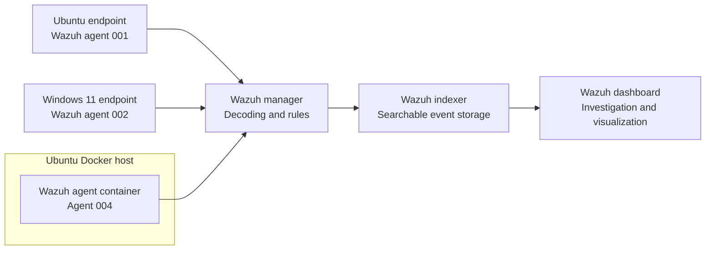
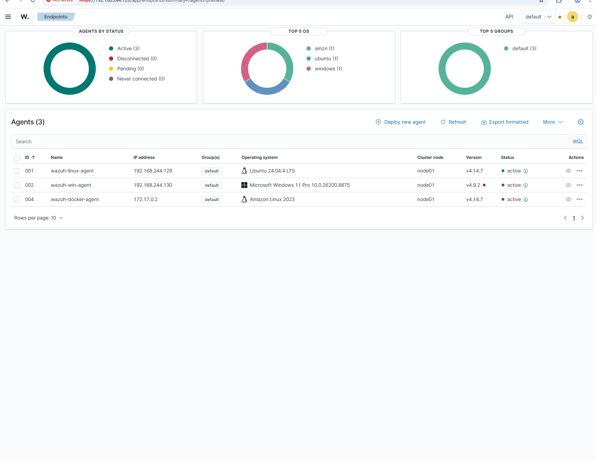
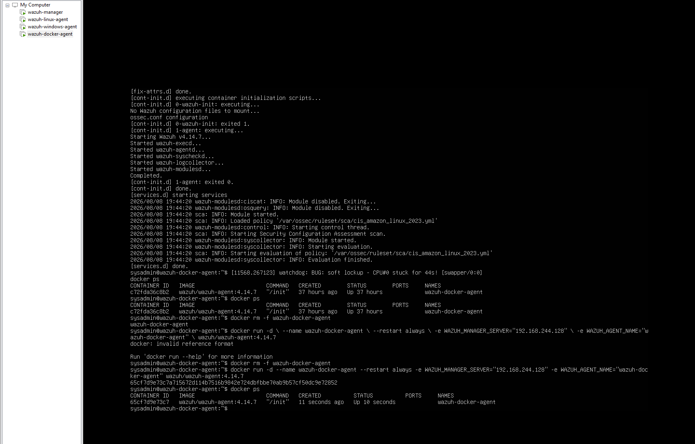
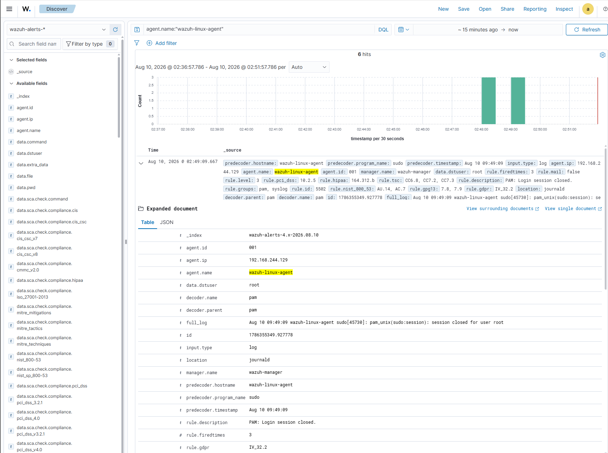
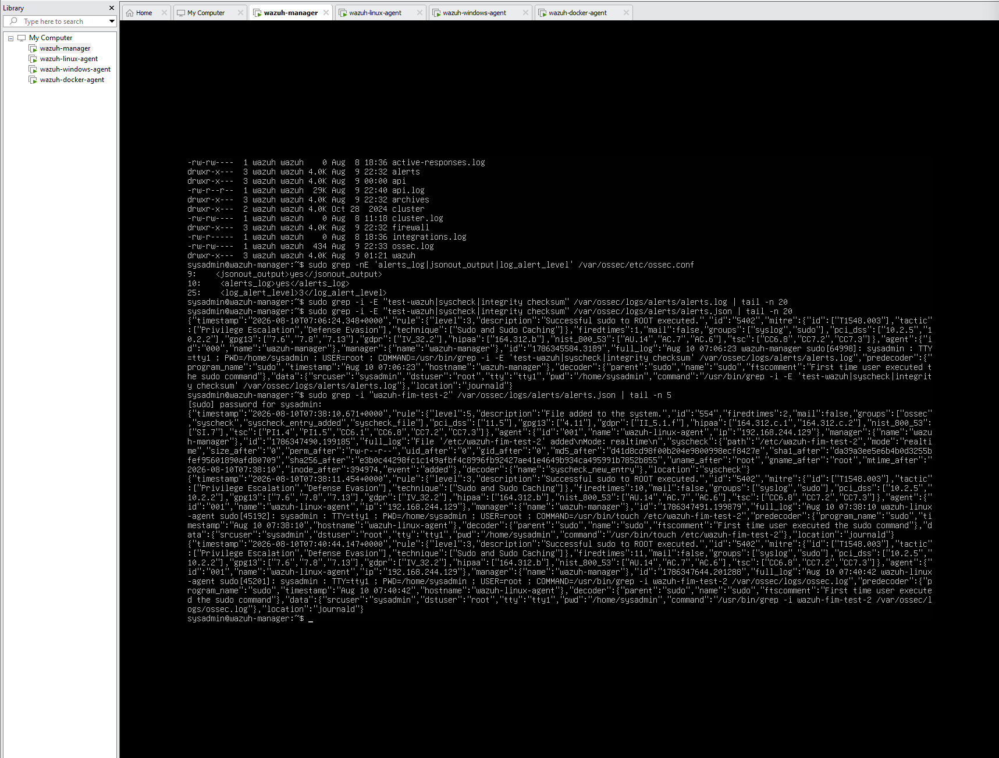
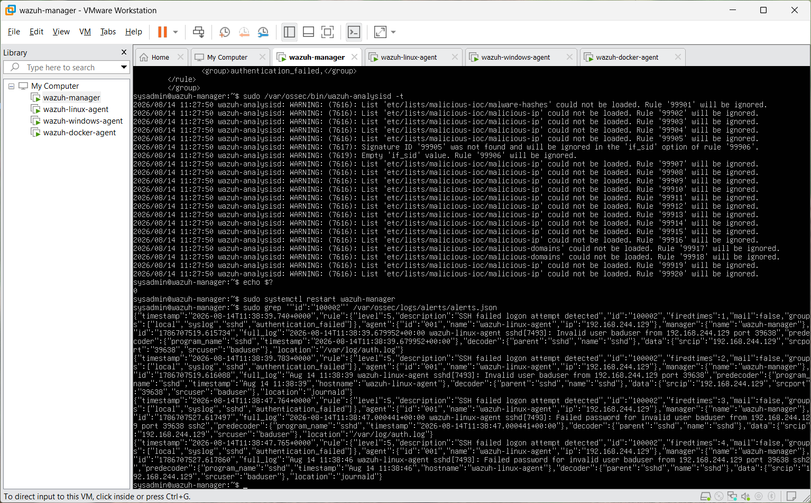
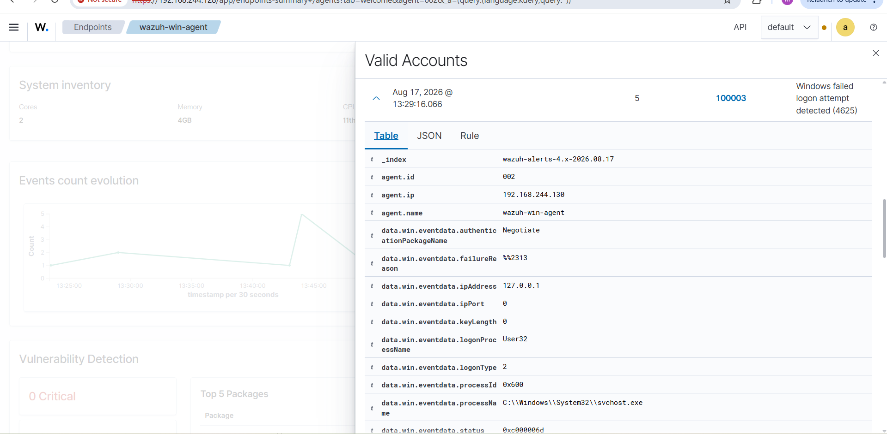
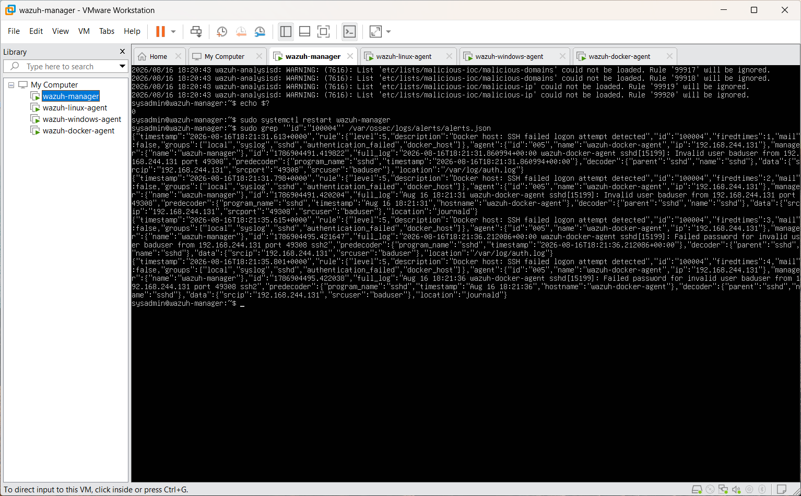
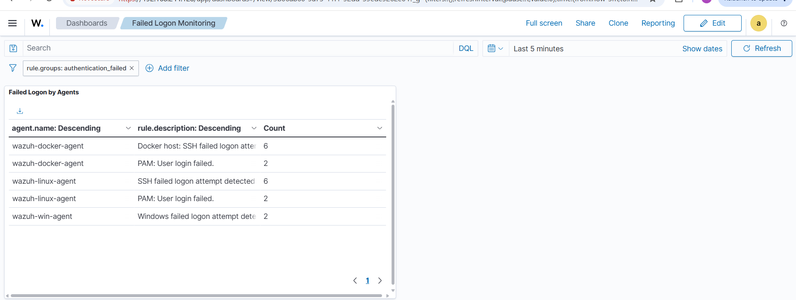
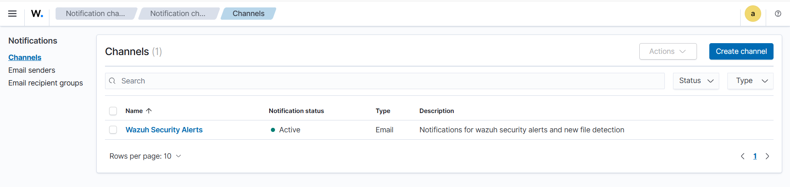

# Week 1 — Wazuh Multi-Agent SIEM and Detection Engineering Lab

## Overview

Week 1 focused on deploying a Wazuh SIEM environment and enrolling heterogeneous endpoints through three paths: a package-based Linux agent, a Windows MSI agent, and a Wazuh agent running in Docker.

After completing the deployment objectives, I extended the lab with real-time File Integrity Monitoring (FIM), custom failed-authentication detections, cross-platform alert visualization, and troubleshooting across the complete Wazuh event pipeline.

## Objectives

The core objectives were to:

- deploy the Wazuh manager, indexer, and dashboard;
- enroll an Ubuntu Linux endpoint;
- enroll a Windows 11 endpoint;
- deploy and enroll a Wazuh agent in Docker;
- confirm that all three non-manager agents were active;
- identify which endpoint generated an event; and
- explain the roles of the Wazuh agent, manager, indexer, and dashboard.

The lab was extended to include:

- real-time FIM;
- custom Linux SSH failed-logon detection;
- custom Windows Event ID 4625 detection;
- host-specific detection scoping;
- a cross-platform failed-logon dashboard; and
- email notification-channel configuration.

## Architecture



The Docker host was later enrolled separately as agent `005` while I tested host-level SSH detections. This later extension is distinct from the containerized agent that satisfied the original enrollment objective.

See [Wazuh architecture explained](./docs/wazuh-architecture.md) for the component and data-flow breakdown.

## Core result

All three original non-manager agents—Linux, Windows, and the containerized Wazuh agent—were enrolled and simultaneously reported as active.



| Endpoint | Platform | Enrollment path |
| --- | --- | --- |
| `wazuh-linux-agent` | Ubuntu Linux | Package-based Wazuh agent |
| `wazuh-win-agent` | Windows 11 | MSI installer |
| Containerized agent | Amazon Linux container | `wazuh/wazuh-agent` Docker image |

## Implementation and validation

### Central stack

I deployed the Wazuh manager, indexer, and dashboard with the all-in-one installation method. I verified each service before enrolling endpoints and later upgraded the central components to Wazuh `4.14.7`.

### Linux endpoint

I installed the Wazuh agent with the package-based deployment path, enrolled it with the manager, and confirmed both local service health and active status in the dashboard. An early manager/agent version mismatch required the Linux package to be aligned with the manager before the endpoint registered successfully.

### Windows endpoint

I installed the Windows agent with the Wazuh MSI package and configured it to use the lab manager. The `WazuhSvc` service did not initially start automatically, so I inspected its state, started it manually, and confirmed that the endpoint became active.

### Dockerized endpoint

I deployed the official Wazuh agent image on a dedicated Ubuntu Docker host.



The container initially started without a valid manager address because its initialization script expected a different environment-variable name from the one supplied. I inspected the container environment, generated configuration, and startup script, then recreated the container with the expected variable and re-enrolled it.

### Event attribution

Individual alerts exposed `agent.id`, `agent.name`, `agent.ip`, `manager.name`, rule ID, and rule description. I used these fields to trace events to their originating endpoints.



## Detection engineering extensions

### File Integrity Monitoring

I enabled real-time FIM for selected Linux paths and generated controlled file-creation and deletion activity. Wazuh produced Rule `554` (file added) and Rule `553` (file deleted) alerts.



```text
Filesystem activity → Syscheck/FIM → Agent → Manager → Rule → Indexer → Dashboard
```

### Linux failed SSH detection

The first custom Linux rule inherited from Wazuh Rule `5716`. Testing with a nonexistent user showed that the actual event matched the more specific Rule `5710`. I corrected the parent rule and scoped the detection to the Linux hostname.

Final result: **Rule `100002` — SSH failed logon attempt detected**.



### Windows failed-logon detection

Windows failed-authentication telemetry arrived through Windows Event Channel. I created a child rule of Wazuh Rule `60122`, which represents an unknown user or bad-password logon failure associated with Windows Event ID `4625`.

Final result: **Rule `100003` — Windows failed logon attempt detected (4625)**.



### Docker-host failed SSH detection

During the extension phase, I installed a Wazuh agent directly on the Ubuntu Docker host so I could monitor its host-level SSH logs independently from the containerized agent.

Final result: **Rule `100004` — Docker host: SSH failed logon attempt detected**.



This required explicit, non-overlapping hostname conditions for the Linux and Docker-host rules. An earlier unscoped Linux rule otherwise matched Docker-host events before the intended sibling rule.

### Cross-platform dashboard

I combined the custom Linux, Windows, and Docker-host detections in a dedicated failed-logon dashboard.



### Notification channel

I also configured an active email notification channel for Wazuh security alerts. The evidence confirms channel configuration, not end-to-end email delivery.



## Troubleshooting methodology

The main lesson was to troubleshoot the SIEM as a pipeline:

```text
Generate activity
      ↓
Confirm the endpoint recorded it
      ↓
Confirm the agent collected it
      ↓
Confirm the manager received it
      ↓
Identify the decoder and parent rule that matched
      ↓
Inspect the generated alert
      ↓
Confirm the indexed event in the dashboard
```

This approach prevented repeated rule changes when a failure occurred earlier in the collection path. The detailed investigation record is in [Week 1 troubleshooting](./docs/troubleshooting.md).

## Results

By the end of Week 1, I had:

- deployed and maintained the Wazuh central stack;
- enrolled Linux, Windows, and containerized agents;
- verified all three core agents were active;
- attributed security events to their source endpoints;
- configured and validated real-time FIM;
- built custom Linux, Windows, and Docker-host failed-logon rules;
- visualized the detections in one dashboard;
- configured an email notification channel; and
- diagnosed failures involving XML, version alignment, log collection, rule inheritance, hostname scoping, Docker configuration, services, permissions, and enrollment state.

## Skills demonstrated

- Wazuh SIEM deployment and administration
- Linux and Windows endpoint monitoring
- Dockerized agent deployment
- Log collection and event attribution
- File Integrity Monitoring
- Custom Wazuh rule development
- Windows Event ID 4625 analysis
- SSH authentication monitoring
- Detection validation and dashboard creation
- System service and permissions troubleshooting
- Technical documentation

## Key lesson

A missing alert does not automatically mean that its detection rule is broken. A failure can occur anywhere in the path:

```text
Endpoint → Log source → Agent → Manager → Decoder → Rule → Indexer → Dashboard
```

Validating each stage independently made the investigation systematic and repeatable.

