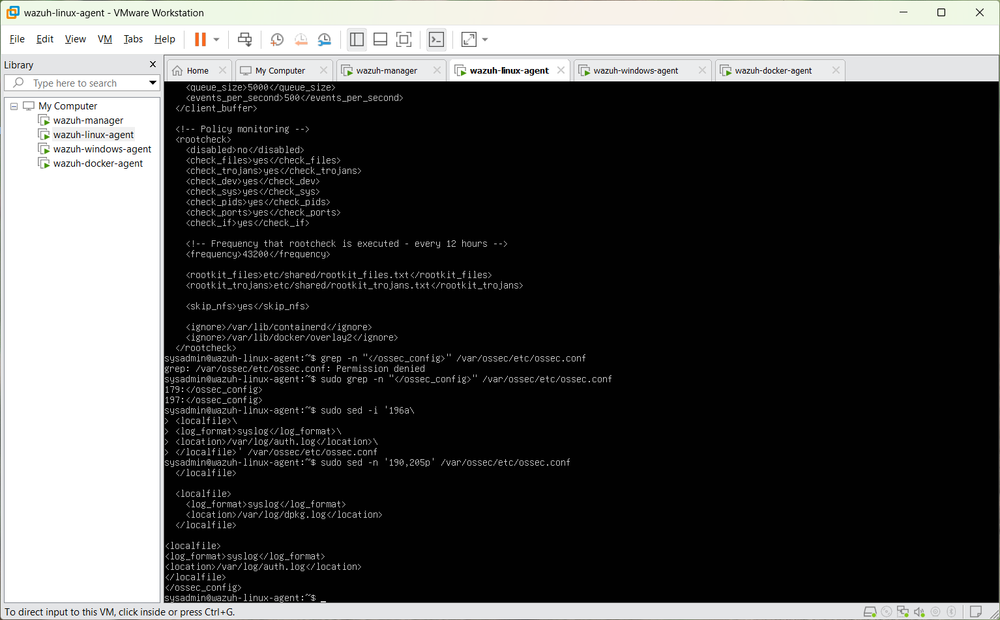
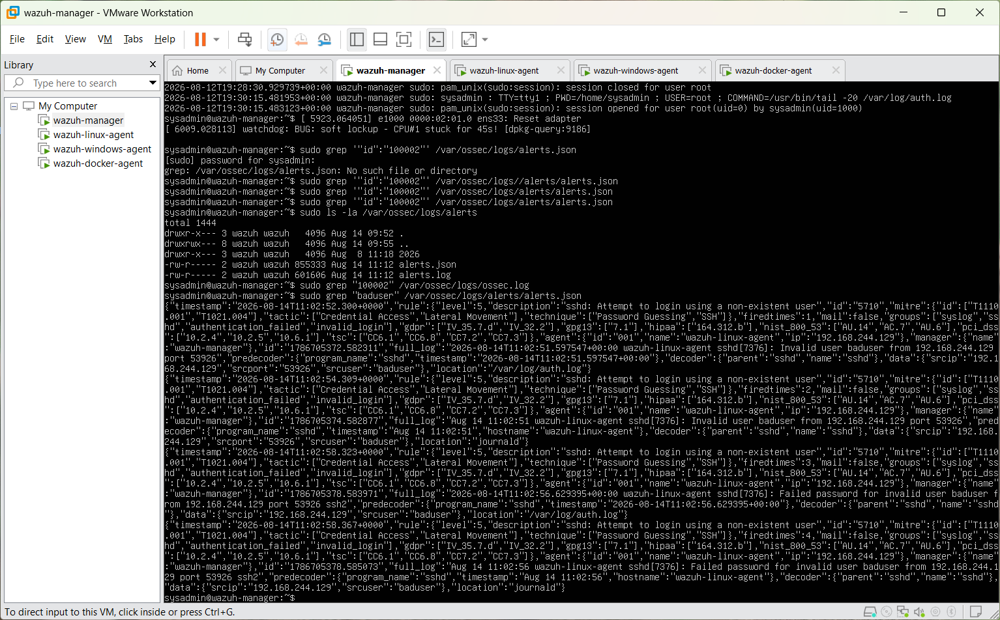
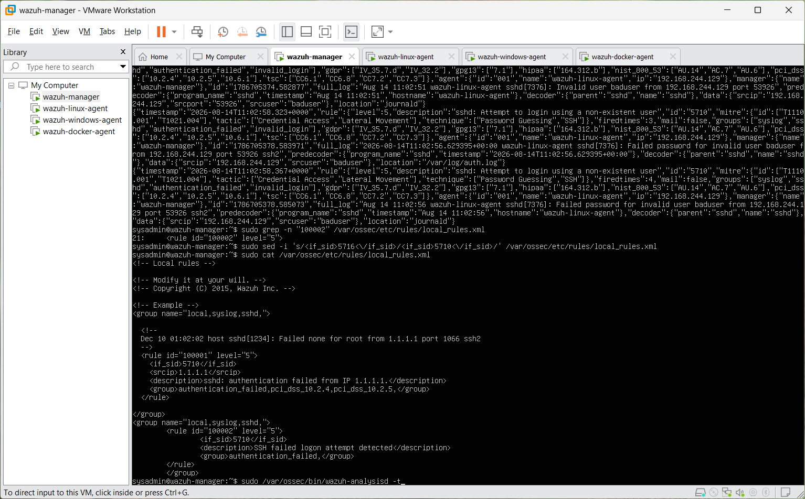
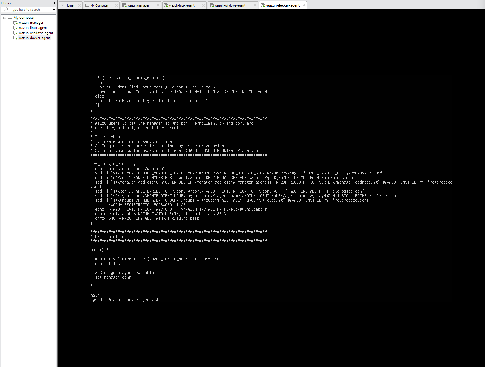
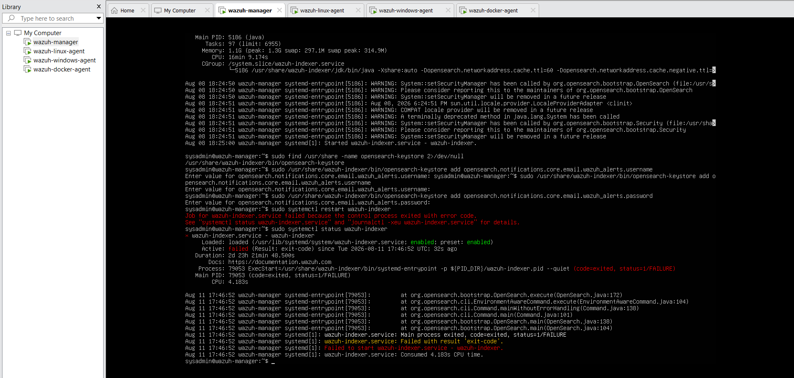
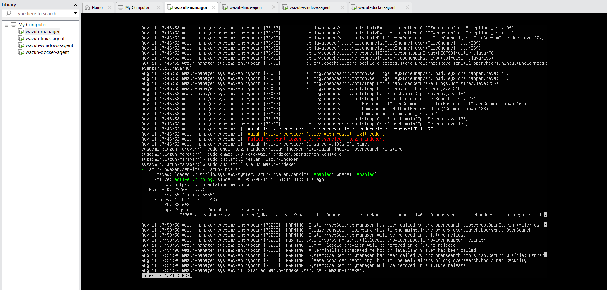

# Week 1 Troubleshooting

This document records the most important failures encountered during the Wazuh lab. Each investigation follows the same structure: problem, investigation, root cause, fix, and lesson learned.

## 1. Linux agent did not appear in the manager

### Problem

The Linux Wazuh agent service was running locally, but the endpoint did not appear as active in the dashboard.

### Investigation

I checked the manager and agent versions, reviewed the enrollment state, and attempted manual enrollment with `agent-auth`.

### Root cause

The endpoint initially had a newer Wazuh agent package than the `4.9.2` manager stack used at that point in the lab. Local service health did not prove that registration and communication were working.

### Fix

I removed the newer package, installed `wazuh-agent=4.9.2-1` to align with the manager, restarted the agent, and confirmed it appeared as active.

### Lesson learned

Validate agent-manager compatibility and dashboard state separately from the local service state.

---

## 2. Custom SSH rule did not fire because the log source was missing

### Problem

A custom SSH failed-logon rule produced no alert after a controlled failed login.

### Investigation

1. I searched the manager's `alerts.json` for the custom rule and found nothing.
2. I checked `/var/log/auth.log` on the endpoint and confirmed that Linux had recorded the failed authentication.
3. I inspected the agent's `ossec.conf` and found no `<localfile>` entry for `/var/log/auth.log`.

### Root cause

The operating system generated the event, but the Wazuh agent was not configured to collect the authentication log. The event never reached the manager and the rule was never evaluated.

### Fix

I added:

```xml
<localfile>
  <log_format>syslog</log_format>
  <location>/var/log/auth.log</location>
</localfile>
```

I then restarted the agent and repeated the test.



### Lesson learned

Before debugging detection logic, confirm that the endpoint produced the event and that the agent collected its source.

---

## 3. The test matched Rule 5710 instead of Rule 5716

### Problem

After adding the missing log source, the custom rule still did not fire. Its first version inherited from Wazuh Rule `5716`, a generic SSH authentication failure.

### Investigation

I searched `alerts.json` for the test username instead of only searching for the custom rule ID. The event existed, but it had matched Rule `5710`: an attempted login with a nonexistent user.



### Root cause

The test account, `baduser`, did not exist. The event therefore matched Wazuh's more specific nonexistent-user rule rather than the generic failure rule assumed by the custom detection.

### Fix

I changed the custom rule's parent from:

```xml
<if_sid>5716</if_sid>
```

to:

```xml
<if_sid>5710</if_sid>
```



The corrected Rule `100002` then generated the expected alert.

### Lesson learned

Use the classification produced by a real test event. Do not assume which parent rule should have matched.

---

## 4. Docker-host rule used the wrong scoping condition

### Problem

A custom rule intended only for the Docker host did not fire when it used:

```xml
<field name="agent.name">wazuh-docker-agent</field>
```

### Investigation

I confirmed that log collection worked and that Rule `5710` was the correct parent. I then compared the rule condition with the decoded alert data.

### Root cause

The rule attempted to treat agent metadata as a decoded event field. The SSH/syslog event exposed a decoded hostname that could be used for rule scoping.

### Fix

I replaced the condition with:

```xml
<hostname>wazuh-docker-agent</hostname>
```

### Lesson learned

Inspect decoded alert fields before choosing a Wazuh rule option. A label that looks correct is not useful unless it represents data available to the rule engine at that stage.

---

## 5. An unscoped sibling rule absorbed Docker-host events

### Problem

Docker-host SSH failures kept appearing under the Linux custom Rule `100002` instead of Docker-host Rule `100004`.

### Investigation

Both rules inherited from Rule `5710`. The Linux rule had no hostname restriction, so it could match the same Docker-host events targeted by the more specific rule.

### Root cause

The two sibling rules overlapped. The unscoped rule matched events that were intended for the host-specific rule.

### Fix

I added explicit, non-overlapping hostnames to both rules:

```xml
<hostname>wazuh-linux-agent</hostname>
```

and:

```xml
<hostname>wazuh-docker-agent</hostname>
```

### Lesson learned

When multiple custom rules share a parent, review the entire sibling set for overlapping conditions—not only the rule that appears to be failing.

---

## 6. Docker container ran without a configured manager

### Problem

The Wazuh agent container appeared in `docker ps`, but its logs reported an invalid or empty manager address and the agent could not connect.

### Investigation

1. I verified that a manager-related environment variable existed in the container.
2. I inspected the generated `ossec.conf` and found an empty `<address>` element.
3. I inspected the image initialization script to identify the exact variable it expected.



### Root cause

The variable supplied to the container did not match the name expected by the image's initialization script, so the manager address was never written to the configuration.

### Fix

I recreated the container with the expected manager-server variable, verified that the Wazuh agent processes started, and re-enrolled the container. I also removed a stale earlier registration after confirming the replacement was active.

### Lesson learned

A running container does not prove that the application inside it is correctly configured. Validate both container state and application logs.

---

## 7. Indexer failed after notification-keystore changes

### Problem

The Wazuh indexer failed to restart after notification credentials were added to the OpenSearch keystore.



### Investigation

I reviewed the service failure and checked the keystore's owner and permissions.

### Root cause

The keystore did not have the ownership and permissions required by the `wazuh-indexer` service account.

### Fix

I applied the correct service ownership and restricted the file mode to `600`, then restarted the indexer.



### Lesson learned

Security-sensitive configuration files must be readable by the intended service while remaining inaccessible to other users.

---

## 8. Agent changed to pending after VM pause or resume

### Problem

An agent that had previously been active appeared as pending after the virtual machines were paused and resumed.

### Investigation

I checked time synchronization, local service state, and network connectivity to the manager ports.

### Root cause

The most common cause in this lab was clock drift after a paused VM resumed. On other occasions, the agent service needed a manual restart.

### Fix

I re-enabled network time synchronization, corrected the Windows time setting where applicable, and restarted the affected Wazuh agent.

### Lesson learned

In a paused multi-VM security lab, verify endpoint time before making deeper changes to a previously working enrollment.

---

## Reusable investigation checklist

1. Generate controlled endpoint activity.
2. Confirm that the operating system recorded it.
3. Confirm that the agent monitors the correct source.
4. Check agent service and connection state.
5. Search the manager for the raw event, not only the expected custom rule ID.
6. Identify the decoder and built-in rule that actually matched.
7. Validate custom rule syntax and sibling-rule overlap.
8. Confirm that the alert is indexed and visible in the dashboard.

