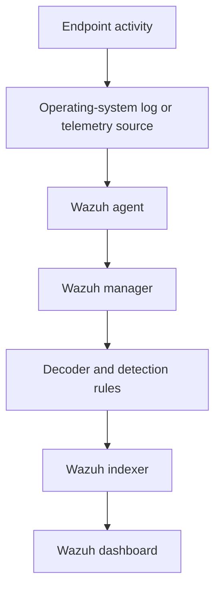

# Wazuh Architecture Explained

## Lab data flow



## Wazuh agent

The agent runs on a monitored endpoint. It collects security-relevant information such as authentication logs, Windows events, file-integrity changes, inventory, and system activity. It forwards the collected data to the Wazuh manager.

In this lab, agents were enrolled through Linux packages, a Windows MSI installer, and a Docker container.

## Wazuh manager

The manager is the primary analysis component. It receives data from agents, decodes incoming events, evaluates the Wazuh ruleset, and generates alerts when event conditions match.

In practical terms, the manager answered: **What happened, how should it be classified, and should it become an alert?**

## Wazuh indexer

The indexer stores and organizes the alerts and security data produced by the Wazuh environment. Its indexed storage allows events to be searched and retrieved efficiently.

The manager performs analysis; the indexer makes the resulting data searchable.

## Wazuh dashboard

The dashboard is the analyst-facing interface. It was used in this lab to:

- view enrolled agents and their connection state;
- search security events;
- inspect rule and agent metadata;
- investigate individual alerts; and
- build a cross-platform failed-logon view.

## Component summary

| Component | Primary role |
| --- | --- |
| Agent | Collects endpoint telemetry |
| Manager | Decodes events, applies rules, and generates alerts |
| Indexer | Stores and indexes security data |
| Dashboard | Displays, searches, and visualizes the data |

The shortest useful summary is:

```text
Agent collects → Manager analyzes → Indexer stores → Dashboard displays
```

