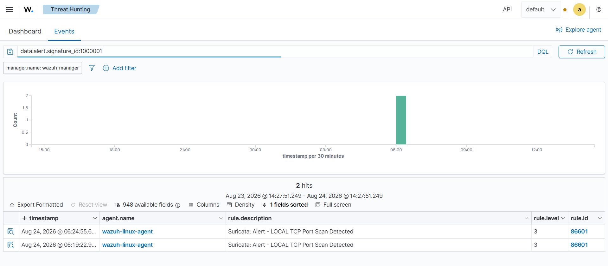
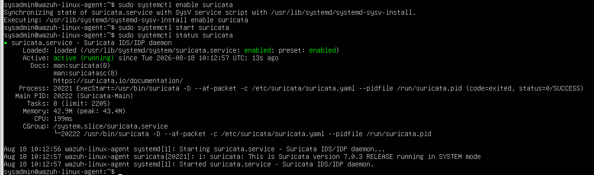
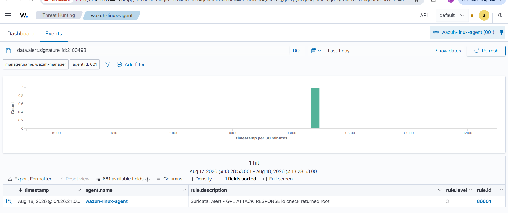
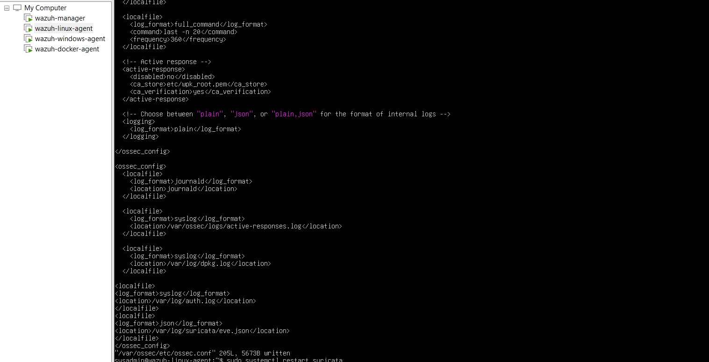
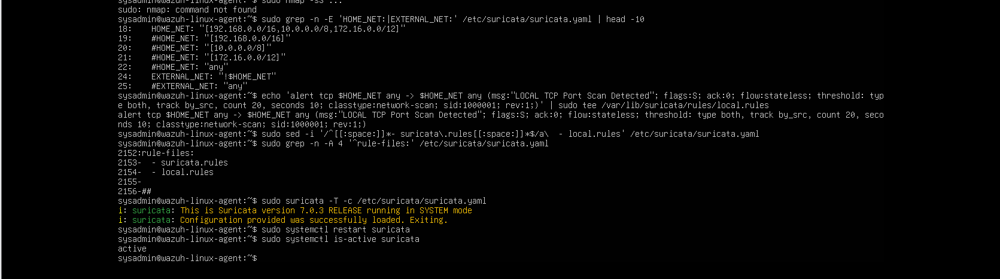
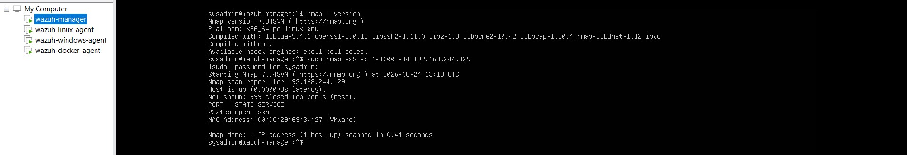
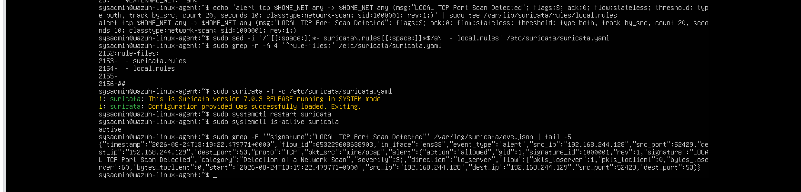
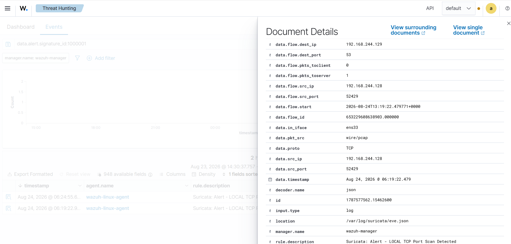

# Week 2 — Suricata and Wazuh Network Detection

## Overview

Week 2 focused on integrating Suricata network telemetry with Wazuh so network alerts could be investigated alongside endpoint events.

The lab was validated end to end:

```text
Network traffic
      ↓
Suricata on wazuh-linux-agent
      ↓
/var/log/suricata/eve.json
      ↓
Wazuh Agent
      ↓
Wazuh Manager
      ↓
Wazuh Threat Hunting
```

The main engineering challenge was not basic ingestion. Suricata was capturing traffic and Wazuh was already receiving other Suricata alerts, but the intended internal Nmap SYN-scan test did not produce a correctly labelled port-scan alert. The investigation therefore moved from connectivity and ingestion to Suricata rule behavior.

## Objectives

- Install and run Suricata on the Linux endpoint.
- Monitor the interface carrying lab traffic.
- Enable the Emerging Threats Open ruleset.
- Confirm Suricata writes JSON events to `eve.json`.
- Configure the Wazuh agent to collect the Suricata log.
- Confirm Suricata alerts are decoded and searchable in Wazuh.
- Generate a controlled TCP port scan from a separate lab VM.
- Produce a visible, correctly labelled network-scan alert in Wazuh.
- Document the troubleshooting process and detection limitations.

## Lab systems

| Role | Host | Address | Relevant detail |
| --- | --- | --- | --- |
| Scanner and Wazuh Manager | `wazuh-manager` | `192.168.244.128` | Generated the controlled Nmap test |
| Suricata sensor and target | `wazuh-linux-agent` | `192.168.244.129` | Captured traffic on `ens33` and forwarded `eve.json` |

Both addresses are private lab addresses. All testing was performed in an isolated environment.

## Architecture

```text
wazuh-manager (192.168.244.128)
Nmap SYN scan, ports 1–1000
              │
              ▼
wazuh-linux-agent (192.168.244.129)
ens33 → Suricata → SID 1000001
              │
              ▼
/var/log/suricata/eve.json
              │
              ▼
Wazuh Agent → Wazuh Manager → Rule 86601 → Threat Hunting
```

See [the architecture document](./docs/architecture.md) for the component responsibilities and data flow.

## Final detection in Wazuh

The completed integration produced a correctly labelled port-scan alert in Wazuh Threat Hunting. The dashboard maps the Suricata event to Wazuh rule `86601` while preserving the custom signature ID `1000001`.



## Implementation

### 1. Correct the capture interface

The initial `af-packet` configuration referenced `eth0`, but the active interface carrying the VM's lab traffic was `ens33`. Suricata was updated to monitor `ens33`, then its service was verified as active.

The lab screenshots show Suricata `7.0.3` running during this validation.



### 2. Load and validate Suricata rules

The ET/Open source was enabled with `suricata-update`. During one update attempt, name resolution failed and the updater used cached rules; the ruleset still loaded successfully. A known Suricata test alert was later generated and observed in both `eve.json` and Wazuh, proving that packet capture, rule evaluation, JSON output, Wazuh collection, and Wazuh decoding were working.



### 3. Collect `eve.json` with Wazuh

The Wazuh agent was configured to monitor Suricata's JSON event log:

```xml
<localfile>
  <log_format>json</log_format>
  <location>/var/log/suricata/eve.json</location>
</localfile>
```

The reusable snippet is available in [`configs/wazuh-suricata-localfile.xml`](./configs/wazuh-suricata-localfile.xml).



### 4. Investigate the missing scan alert

The controlled test was:

```bash
sudo nmap -sS -p 1-1000 -T4 192.168.244.129
```

Suricata saw the scan traffic and produced flow and stream-related records, but it did not generate the intended port-scan label. Because other Suricata alerts already appeared in Wazuh, this ruled out a general Suricata-to-Wazuh pipeline failure.

The active ruleset was confirmed through these settings:

```yaml
default-rule-path: /var/lib/suricata/rules

rule-files:
  - suricata.rules
```

Ruleset inspection found that the relevant ET Nmap SYN-scan signatures examined in the lab were commented out. The network variables also classified both the scanner and target as internal:

```yaml
HOME_NET: "[192.168.0.0/16,10.0.0.0/8,172.16.0.0/12]"
EXTERNAL_NET: "!$HOME_NET"
```

The test therefore represented `HOME_NET → HOME_NET` traffic, while many of the stock scan rules examined were written around `EXTERNAL_NET → HOME_NET` behavior.

### 5. Add an internal SYN-scan rule

Rather than changing the meaning of `HOME_NET` simply to make a stock rule fire, a local rule was created for the actual lab scenario:

```suricata
alert tcp $HOME_NET any -> $HOME_NET any (msg:"LOCAL TCP Port Scan Detected"; flags:S; ack:0; flow:stateless; threshold: type both, track by_src, count 20, seconds 10; classtype:network-scan; sid:1000001; rev:1;)
```

The rule detects a source producing at least 20 matching TCP SYN attempts within 10 seconds. It is stored in [`rules/local.rules`](./rules/local.rules).


`local.rules` was then added to the rule-file list:

```yaml
rule-files:
  - suricata.rules
  - local.rules
```

### 6. Validate before restarting

The full Suricata configuration was tested before restarting the service:

```bash
sudo suricata -T -c /etc/suricata/suricata.yaml
```

The validation returned:

```text
Configuration provided was successfully loaded. Exiting.
```

Suricata was then restarted and checked:

```bash
sudo systemctl restart suricata
sudo systemctl is-active suricata
```

Expected result:

```text
active
```



## Validated result

The final Nmap SYN scan was run from `192.168.244.128` against `192.168.244.129`. The scan covered TCP ports `1–1000`; the captured result showed port `22/tcp` open and `999` tested ports closed.



Suricata wrote an alert to `eve.json` containing:

```text
signature: LOCAL TCP Port Scan Detected
signature_id: 1000001
category: Detection of a Network Scan
severity: 3
```



In Wazuh Threat Hunting, this query returned the integrated alert:

```text
data.alert.signature_id:1000001
```

Wazuh displayed:

```text
Suricata: Alert - LOCAL TCP Port Scan Detected
rule.id: 86601
rule.level: 3
```

The identifiers describe different layers:

- `1000001` is the custom Suricata signature ID.
- `86601` is the Wazuh rule that processed the Suricata alert.

The event fields confirmed the controlled test path:

```text
source:      192.168.244.128
destination: 192.168.244.129
interface:   ens33
location:    /var/log/suricata/eve.json
```



## Detection caveats

- The custom signature detects TCP SYN-scan behavior; it does not fingerprint the Nmap application.
- The test attribution is valid because the scan was deliberately generated with Nmap from the source address recorded in the alert.
- The threshold rule is appropriate for controlled lab validation but may also match legitimate bursts of internal SYN traffic.
- Production use would require baselining, exclusions, threshold tuning, and validation against expected internal services.
- The investigation found two relevant conditions—commented ET signatures and a `HOME_NET → HOME_NET` test path. The evidence does not justify claiming that either condition alone explains every stock signature's behavior.

## Troubleshooting method

The investigation followed the pipeline rather than repeatedly changing rules:

1. Confirm the scan reached the target.
2. Confirm Suricata captured the traffic.
3. Confirm `eve.json` continued to receive events.
4. Confirm other Suricata alerts reached Wazuh.
5. Identify the active rules file.
6. Inspect Nmap- and scan-related signatures.
7. Review `HOME_NET` and `EXTERNAL_NET` classification.
8. Create a local rule for the actual internal test path.
9. Validate the configuration before restart.
10. Confirm the alert first in `eve.json`, then in Wazuh.
11. Verify source and destination fields against the controlled test.

The full chronology is documented in [`docs/troubleshooting.md`](./docs/troubleshooting.md).

## Results

- Suricata monitored the correct interface.
- ET/Open rules were enabled and loaded.
- Suricata generated JSON alerts in `eve.json`.
- Wazuh collected and decoded Suricata alerts.
- A controlled internal SYN scan triggered custom SID `1000001`.
- Wazuh mapped the event to rule `86601` and displayed it in Threat Hunting.
- The alert preserved source, destination, interface, signature, and log-location context.
- The rule's limitations and tuning requirements were documented.

## Skills demonstrated

- Network intrusion detection
- Suricata administration
- Wazuh integration
- JSON log collection
- Network traffic analysis
- Detection engineering
- Rule and variable inspection
- Controlled adversarial testing with Nmap
- Alert validation and attribution
- Troubleshooting across a multi-stage detection pipeline

## Key lesson

Visible traffic does not guarantee that a useful detection rule will match it. A reliable investigation separates packet capture, rule evaluation, log output, SIEM ingestion, decoding, and visualization, then validates each layer independently.
