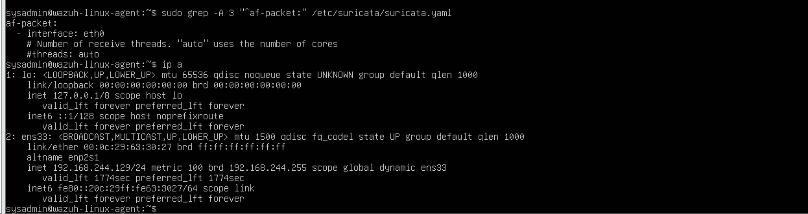
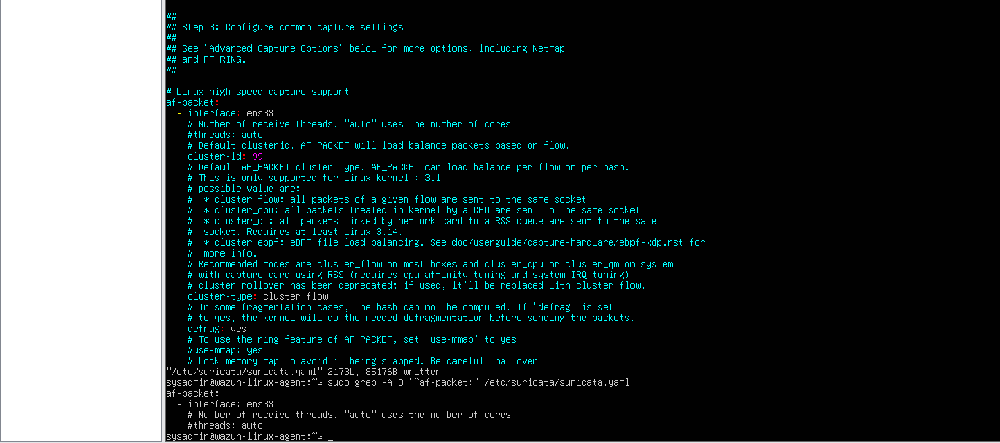
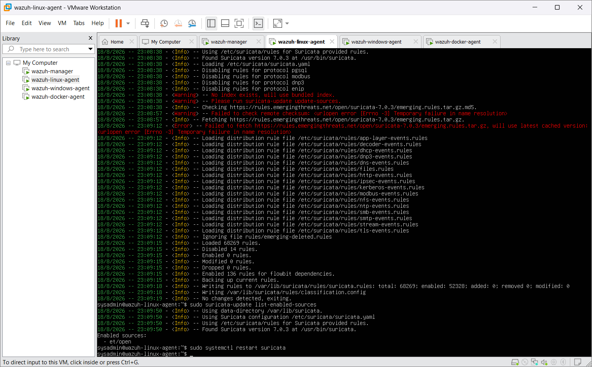
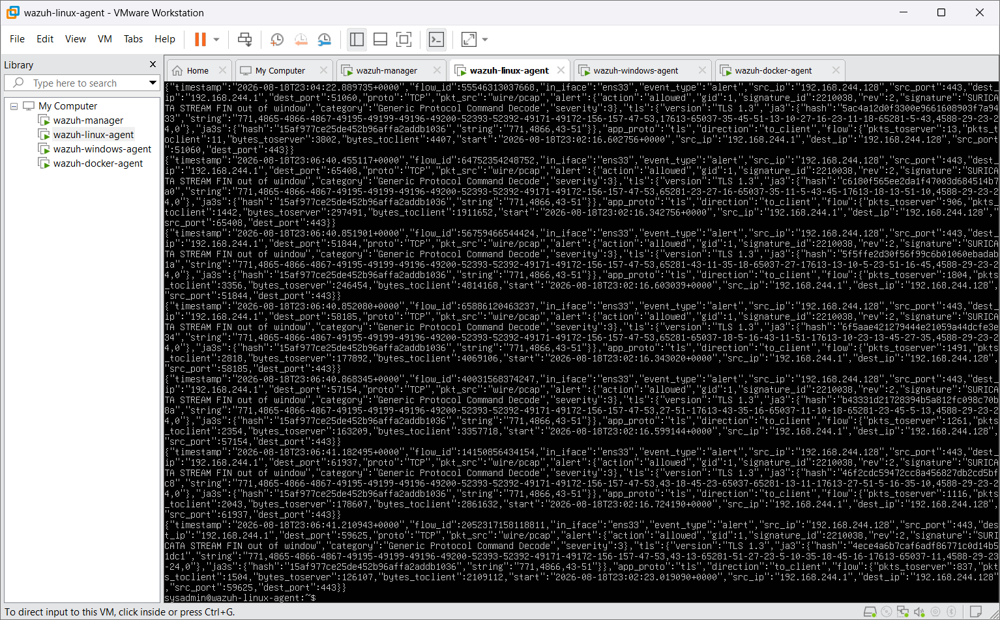
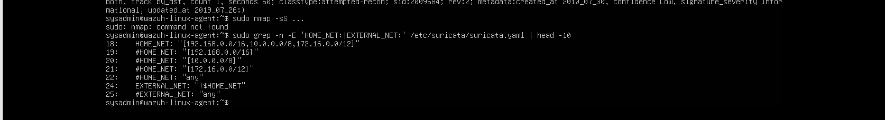

# Week 2 Troubleshooting — Missing Port-Scan Alert

## 1. Incorrect capture interface

### Problem

Suricata was initially configured to monitor `eth0`, but the Linux VM's active lab interface was `ens33`.

### Investigation

The interface list was compared with the `af-packet` section of `/etc/suricata/suricata.yaml`.



### Root cause

The configured interface did not match the interface carrying the relevant lab traffic.

### Fix

The Suricata configuration was changed to:

```yaml
af-packet:
  - interface: ens33
```

Suricata was restarted and confirmed active.



### Lesson learned

A running network sensor is not proof that it is monitoring the correct interface.

## 2. ET/Open update encountered name-resolution failure

### Problem

An ET/Open ruleset update could not reach its remote source because name resolution failed.

### Investigation

The update output was reviewed rather than treating the entire ruleset as unavailable.

### Result

`suricata-update` used its cached rules and completed rule loading. Later configuration and detection tests confirmed that Suricata's rules engine remained operational.



### Lesson learned

Separate a remote update failure from local rule availability. Cached rules can remain usable even when the latest fetch fails.

## 3. Traffic was visible, but the expected alert was missing

### Problem

The following controlled scan did not produce a correctly labelled port-scan alert:

```bash
sudo nmap -sS -p 1-1000 -T4 192.168.244.129
```

### Investigation

- Suricata flow records appeared in `eve.json`.
- Generic stream-related Suricata alerts also appeared during testing.
- Other known Suricata alerts were already searchable in Wazuh.
- Wazuh was configured to collect `/var/log/suricata/eve.json`.

### Conclusion

Packet visibility and the Suricata-to-Wazuh path were working. The fault domain was narrowed to detection logic for this specific test.



### Lesson learned

Do not restart or rebuild a working ingestion pipeline when the evidence points to signature behavior.

## 4. Confirm the active Suricata ruleset

### Investigation

The relevant `suricata.yaml` values were checked:

```yaml
default-rule-path: /var/lib/suricata/rules

rule-files:
  - suricata.rules
```

This identified the active ruleset as:

```text
/var/lib/suricata/rules/suricata.rules
```

### Lesson learned

Ruleset investigation is only meaningful after confirming which file the running sensor actually loads.

## 5. Stock Nmap signatures did not fit the lab test

### Investigation

The active ruleset was searched for `Nmap`, `port scan`, and `portscan`. Several rules targeted specific Nmap characteristics such as scripting-engine traffic, HTTP user agents, or probe patterns.

The ET Nmap SYN-scan signatures examined during the lab were commented out. Their leading `#` meant Suricata was not evaluating those particular rules.

The network variables were also checked:

```yaml
HOME_NET: "[192.168.0.0/16,10.0.0.0/8,172.16.0.0/12]"
EXTERNAL_NET: "!$HOME_NET"
```

Both `192.168.244.128` and `192.168.244.129` fall within `HOME_NET`. The controlled scan therefore followed `HOME_NET → HOME_NET`, while many stock signatures examined expected `EXTERNAL_NET → HOME_NET` traffic.



### Root cause statement

The evidence supports two contributing conditions: the relevant ET rules examined were disabled, and the test path did not match the external-to-internal direction used by many stock scan signatures. It does not prove that either condition alone explains every ET rule.

### Decision

`HOME_NET` was not redefined merely to force a stock alert. A local rule was created for the actual internal scanning scenario.

### Lesson learned

Network variables express security meaning. Changing them only to satisfy a test can make the configuration less accurate.

## 6. Build and validate a local rule

### Rule

```suricata
alert tcp $HOME_NET any -> $HOME_NET any (msg:"LOCAL TCP Port Scan Detected"; flags:S; ack:0; flow:stateless; threshold: type both, track by_src, count 20, seconds 10; classtype:network-scan; sid:1000001; rev:1;)
```

The rule was saved at:

```text
/var/lib/suricata/rules/local.rules
```

and loaded through:

```yaml
rule-files:
  - suricata.rules
  - local.rules
```

### Validation

```bash
sudo suricata -T -c /etc/suricata/suricata.yaml
```

Successful output:

```text
Configuration provided was successfully loaded. Exiting.
```

Only then was Suricata restarted:

```bash
sudo systemctl restart suricata
sudo systemctl is-active suricata
```

### Lesson learned

Validate rules and configuration before restarting a production-like service.

## 7. Validate Suricata before validating Wazuh

### Test

From `wazuh-manager` (`192.168.244.128`):

```bash
sudo nmap -sS -p 1-1000 -T4 192.168.244.129
```

### Suricata result

`eve.json` contained:

```text
signature: LOCAL TCP Port Scan Detected
signature_id: 1000001
category: Detection of a Network Scan
severity: 3
```

### Wazuh result

Threat Hunting query:

```text
data.alert.signature_id:1000001
```

Returned:

```text
Suricata: Alert - LOCAL TCP Port Scan Detected
rule.id: 86601
rule.level: 3
```

The event recorded source `192.168.244.128`, destination `192.168.244.129`, interface `ens33`, and location `/var/log/suricata/eve.json`.

### Lesson learned

Validate the native sensor output first, then confirm the SIEM representation. This separates a detection failure from an ingestion or decoding failure.

## 8. Tuning caveat

The local rule is deliberately simple. It detects bursts of TCP SYN traffic and does not identify the scanning program itself. During validation, another internal SYN burst also matched the threshold, demonstrating possible false positives.

Production tuning could include:

- baselining normal SYN rates,
- excluding approved scanners and monitoring systems,
- narrowing protected destinations,
- adjusting the count and time window,
- correlating SYN attempts with distinct destination ports,
- monitoring alert frequency after deployment.

The current rule should be presented as a controlled lab detection, not a production-ready universal port-scan detector.
