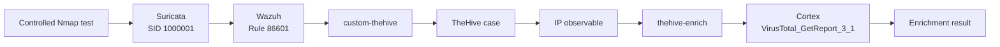
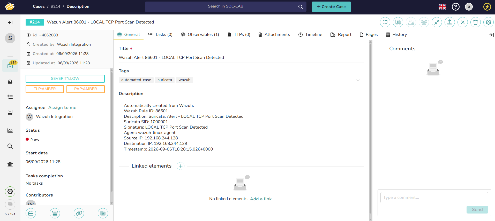
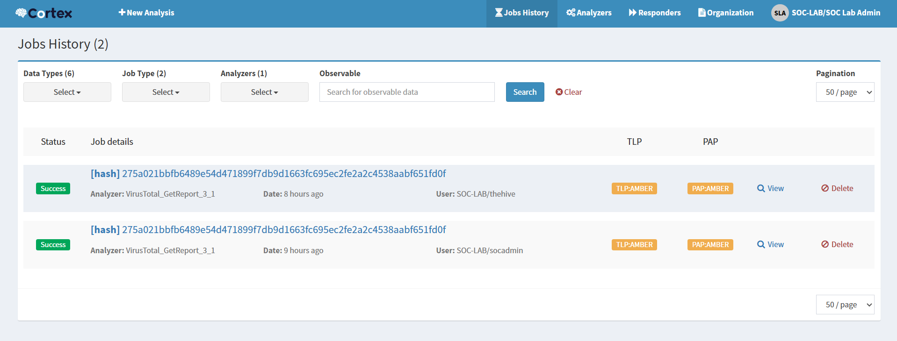
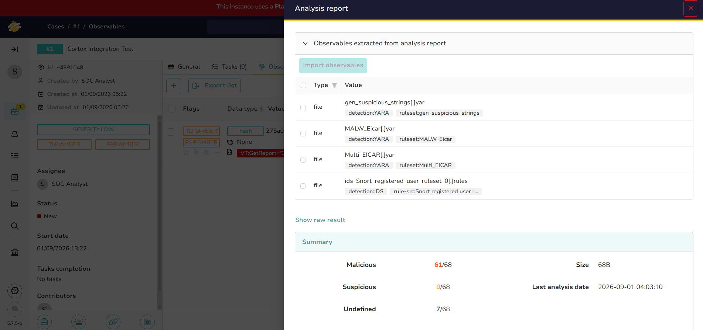
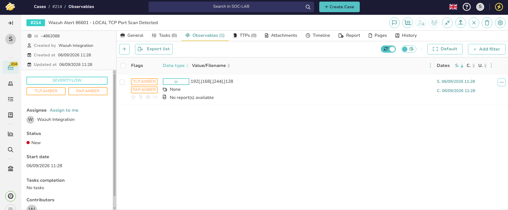
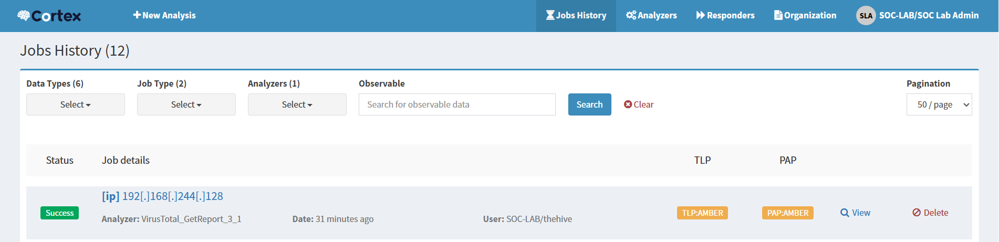
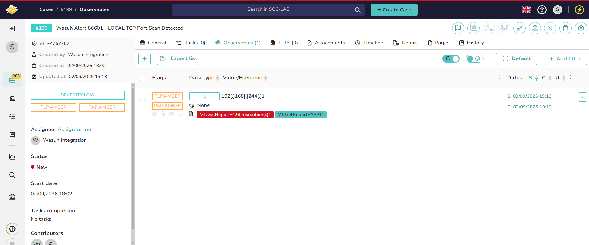
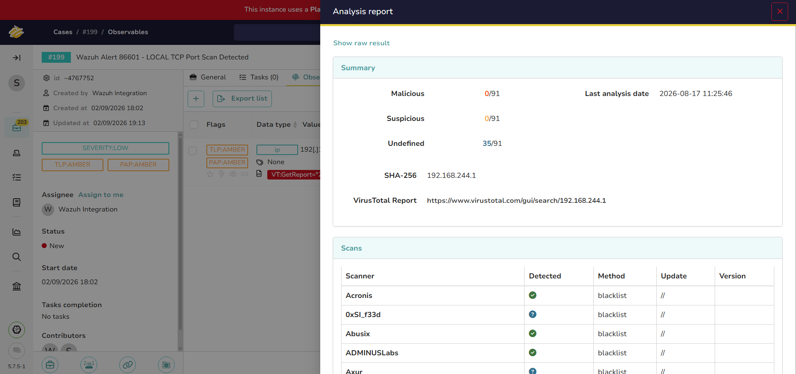

# Week 3 — Wazuh, TheHive and Cortex Case Management

## Overview

Week 3 turned the Week 2 network detection into a case-management and enrichment workflow. A live Suricata port-scan alert was processed by Wazuh, passed to a custom integration, converted into a structured TheHive case, and enriched through Cortex.

The core objective and stretch goal were both validated:

```text
Suricata alert
      ↓
Wazuh rule 86601
      ↓
custom-thehive integration
      ↓
TheHive case
      ↓
IP observable
      ↓
Cortex VirusTotal analyzer
      ↓
Enrichment job completed
```

The most important engineering lesson was that a working integration is not automatically a well-tuned one. Authentication, permissions, asynchronous object availability, helper execution, error handling, and case deduplication all affected the result.

## Objectives

- Deploy TheHive and Cortex in the lab.
- Configure a VirusTotal analyzer and validate it with a known test indicator.
- Connect TheHive to Cortex so analyzers are available from a case.
- Build a Wazuh-to-TheHive integration for selected alerts.
- Reuse the Week 2 Suricata port-scan detection as a live trigger.
- Automatically create a meaningful TheHive case from the alert.
- Enrich an indicator associated with that case.
- Stretch goal: automatically create the observable and submit the Cortex job during case creation.

## Lab components

| Component | Responsibility |
| --- | --- |
| Suricata | Generated the `LOCAL TCP Port Scan Detected` alert with SID `1000001` |
| Wazuh | Processed the Suricata event as rule `86601` and invoked the integration |
| `custom-thehive` | Parsed the Wazuh alert and created a structured TheHive case |
| TheHive | Managed the investigation case and its observables |
| `thehive-enrich` | Added the observable and submitted the analyzer job |
| Cortex | Executed `VirusTotal_GetReport_3_1` |
| VirusTotal | Returned indicator reputation and enrichment data |

TheHive and Cortex were deployed with Docker Compose alongside their supporting lab services. Existing Wazuh components from Weeks 1–2 remained the detection source.

## Architecture



See [the architecture document](./docs/architecture.md) for component boundaries, identifiers, and trust considerations.

## Final end-to-end result

The final integration log recorded all four automation milestones for the same workflow:

```text
SUCCESS rule=86601 HTTP=201
ENRICH_HELPER_LAUNCHED
OBSERVABLE_SUCCESS
CORTEX_SUCCESS ... HTTP=201
```


TheHive Case `#214` was created by the Wazuh integration and titled:

```text
Wazuh Alert 86601 - LOCAL TCP Port Scan Detected
```

The case description preserved the Wazuh rule ID, Suricata SID, signature, agent, source, destination, and timestamp.



## Implementation

### 1. Deploy and connect TheHive and Cortex

TheHive and Cortex were deployed as containerized lab services. The Cortex connector was added to TheHive and validated as enabled and healthy before analyzer testing.

The integration was first tested independently of Wazuh. This separated case-management and analyzer problems from alert-forwarding problems.

### 2. Validate VirusTotal enrichment with a test hash

A known EICAR test-file SHA-256 value was added to a controlled TheHive case as a hash observable. The `VirusTotal_GetReport_3_1` analyzer was launched through Cortex.

Cortex Jobs History recorded successful executions for the hash:



The resulting TheHive report showed `61/68` malicious detections for the known test hash. This was stronger validation than using a private lab IP, because public reputation services do not normally provide meaningful reputation for RFC1918 addresses.



### 3. Configure the Wazuh integration trigger

Wazuh was configured to run the custom integration for Suricata alerts processed as rule `86601`:

```xml
<integration>
  <name>custom-thehive</name>
  <rule_id>86601</rule_id>
  <alert_format>json</alert_format>
</integration>
```

The reusable, sanitized block is available in [`configs/wazuh-thehive-integration.xml`](./configs/wazuh-thehive-integration.xml).

API credentials were stored outside the public scripts and are not included in this repository. The original screenshots containing passwords, API keys, and session cookies were deliberately excluded.

### 4. Create a structured case from a live alert

The Week 2 controlled SYN-scan detection was reused as the trigger:

```text
Suricata signature: LOCAL TCP Port Scan Detected
Suricata SID:       1000001
Wazuh rule:         86601
```

The integration parsed the JSON alert and submitted a case to TheHive. A successful API response returned HTTP `201 Created`.

The automatically created case included:

- alert and rule identifiers,
- source and destination addresses,
- the reporting agent,
- event timestamp,
- `wazuh`, `suricata`, and `automated-case` tags.

### 5. Add an observable and submit a Cortex job

The enrichment helper added the source IP as an observable to the newly created case.



The helper then submitted a `VirusTotal_GetReport_3_1` job through the TheHive-Cortex connector. Cortex Jobs History recorded a successful run for the same IP observable.



The Case `#214` observable page was captured before its report panel refreshed, so it displays no report in that view. The matching Cortex Jobs History provides the completion evidence.

An earlier automatically created Wazuh case, Case `#199`, was captured after the enrichment result returned. Its source-IP observable displays the VirusTotal summary tags inside the same case:



The full VirusTotal analysis report was also opened from that observable inside Case `#199`:



Because the indicator is an RFC1918 private lab address, the `0/91` reputation result is expected. The evidence validates the orchestration path—automatic case creation, observable creation, analyzer execution, and report return—not malicious reputation for the private IP. The EICAR hash test above remains the stronger malicious-indicator enrichment example.

## Success criteria

| Requirement | Result | Evidence |
| --- | --- | --- |
| A live Wazuh alert automatically creates a TheHive case | Complete | Integration HTTP `201` and Case `#214` |
| A Cortex analyzer enriches an indicator from the case workflow | Complete | Observable creation and Cortex job `Success` |
| Record the alert → case → enrichment pipeline | Complete | Final log, case, observable, and job screenshots |
| Stretch: auto-trigger enrichment during case creation | Complete | `ENRICH_HELPER_LAUNCHED`, `OBSERVABLE_SUCCESS`, and `CORTEX_SUCCESS` |

## Troubleshooting and engineering decisions

The successful result required work across several layers:

- VirusTotal analyzer jobs initially failed before later succeeding.
- TheHive-Cortex connector health and container connectivity were validated independently.
- API authentication and account permissions produced authorization failures.
- The observable endpoint returned HTTP `403` until the integration permissions were corrected.
- Cortex submission returned temporary HTTP `404` responses while the new observable became available.
- Python syntax, indentation, response-shape, file-mode, and subprocess issues were corrected.
- The enrichment helper initially lacked executable permissions.
- VMware NAT and agent connectivity interruptions temporarily disrupted validation.
- Triggering on Wazuh rule `86601` alone created too many cases because that rule represents more than the intended custom Suricata signature.


The full chronology, root causes, fixes, and lessons are documented in [`docs/troubleshooting.md`](./docs/troubleshooting.md).

## Detection and automation caveats

This is a controlled lab implementation, not a production-ready SOAR workflow.

- Wazuh rule `86601` can represent multiple Suricata alerts, not only SID `1000001`.
- Filtering only on `86601` caused repeated and unrelated case creation during testing.
- A production design should verify the Suricata signature ID or signature text before creating a case.
- Deduplication should use a stable event key and a time window.
- Retry logic should use bounded exponential backoff and distinguish authorization failures from temporary readiness failures.
- Private RFC1918 addresses are useful for workflow validation but weak indicators for public reputation enrichment.
- Service-account permissions and API credentials should follow least privilege and remain outside source control.

## Repository artifacts

| Path | Purpose |
| --- | --- |
| [`configs/wazuh-thehive-integration.xml`](./configs/wazuh-thehive-integration.xml) | Sanitized Wazuh integration block |
| [`integrations/README.md`](./integrations/README.md) | Verified script responsibilities and public-safe implementation notes |
| [`tests/README.md`](./tests/README.md) | Reproducible validation sequence and expected results |
| [`docs/architecture.md`](./docs/architecture.md) | Detailed data flow and trust boundaries |
| [`docs/troubleshooting.md`](./docs/troubleshooting.md) | Problem, investigation, root cause, fix, and lesson history |
| [`screenshots/README.md`](./screenshots/README.md) | Evidence inventory and security exclusions |

The exact deployed scripts contained environment-specific values and underwent live edits during troubleshooting. Rather than publish an incomplete reconstruction, this repository documents their verified behavior and includes only configuration that can be confirmed from the final evidence.

## Results

- TheHive and Cortex were deployed and connected.
- Cortex successfully executed VirusTotal analysis from TheHive.
- A known test hash returned a detailed enrichment report.
- A live Suricata/Wazuh alert automatically created a structured TheHive case.
- The source IP was automatically added as an observable.
- The Cortex analyzer was automatically submitted and completed successfully.
- Authentication, permission, readiness, execution, connectivity, and case-volume issues were investigated.
- The limitations of broad rule-based triggering and private-IP enrichment were documented.

## Skills demonstrated

- Security case management
- Wazuh custom integrations
- TheHive and Cortex administration
- REST API integration
- Python troubleshooting
- Docker and service connectivity
- Observable and indicator handling
- Threat-intelligence enrichment
- Automated alert-to-case orchestration
- Error handling and retry design
- Security credential hygiene
- Detection and automation tuning

## What I learned

End-to-end automation is a sequence of independently testable contracts. The alert must contain the right fields, the bridge must authenticate, the case API must accept the payload, the observable must become queryable, and Cortex must receive a valid analyzer request. Verifying each boundary separately made the final workflow reliable enough to demonstrate and revealed the next engineering priorities: precise filtering, deduplication, bounded retries, least privilege, and safer secret management.

