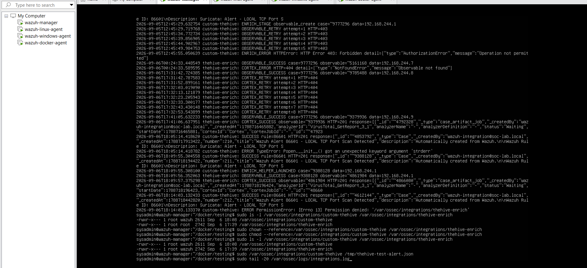

# Week 3 Troubleshooting — Alert-to-Case Automation

## 1. Validate the platform before the workflow

### Problem

TheHive, Cortex, their databases, the Wazuh stack, and Docker networking all had to be healthy before an end-to-end failure could be diagnosed accurately.

### Investigation

The container stack was deployed and checked independently. TheHive connector status, platform schemas, Cortex job storage, container network connectivity, and existing Wazuh services were reviewed before automation testing.

### Decision

The workflow was tested in small contracts:

1. TheHive can reach Cortex.
2. Cortex can run the analyzer.
3. Wazuh can create a TheHive case.
4. The case can accept an observable.
5. The connector can submit that observable to Cortex.

### Lesson learned

End-to-end testing is most useful after each dependency has a known-good local test.

## 2. VirusTotal analyzer failed before succeeding

### Problem

The first VirusTotal analyzer run failed for the hash observable.

### Investigation

- The observable data type and analyzer availability were checked.
- Host connectivity to VirusTotal was tested.
- Connectivity was also tested from a Cortex container on the application network.
- Cortex configuration, job-directory access, and job history were inspected.
- The analyzer was retried only after the surrounding conditions were validated.

### Result

The same analyzer later completed successfully. A known EICAR SHA-256 test value returned a VirusTotal report showing `61/68` malicious detections.

### Root-cause scope

The surviving evidence proves the failure and the recovery, but it does not establish one exclusive root cause. The documentation therefore does not attribute the recovery to a single unverified change.

### Lesson learned

Record what the evidence proves and avoid turning a plausible explanation into a claimed root cause.

## 3. TheHive-Cortex connector validation

### Problem

An analyzer can be healthy in Cortex while still being unavailable from a TheHive case if the connector is not configured correctly.

### Investigation

The Cortex connector was added in TheHive and its API status was checked. The observed state was enabled, healthy, and associated with Cortex version `4.1.0-1`.

### Validation

`VirusTotal_GetReport_3_1` appeared as an available hash analyzer in TheHive, launched successfully, and was recorded in Cortex Jobs History.

### Lesson learned

Verify connector discovery and job execution separately. Seeing an analyzer in one product does not prove the full connection works.

## 4. API authentication and secret handling

### Problem

TheHive API tests initially encountered authentication and authorization problems.

### Investigation

The integration account, API authentication method, and profile permissions were reviewed. Requests were tested with a dedicated integration identity.

### Fix

The account and permissions were corrected until an API-created test case appeared in TheHive. The working automation later received HTTP `201 Created` for the live Wazuh alert.

### Security decision

Screenshots containing API keys, passwords, bearer tokens, or session cookies are excluded from the public repository. Published examples use variables and placeholders only.

### Lesson learned

An API key proves identity; permissions still determine which actions that identity can perform.

## 5. Integration script syntax and response handling

### Problem

The custom Python integration went through several live-edit failures, including malformed indentation and syntax, response-shape assumptions, an invalid file mode, and subprocess argument handling.

### Investigation

Edits were followed by syntax checks, direct execution, and log inspection. Case-creation output was inspected to determine whether the response was a list or object before indexing it.

### Fix

The script was corrected incrementally until it logged:

```text
SUCCESS rule=86601 HTTP=201
```

Final working copies of both integration scripts were then preserved in the lab.

### Lesson learned

Validate syntax before service execution, and inspect real API response shapes rather than assuming them.

## 6. Observable creation returned HTTP 403

### Problem

Case creation succeeded, but adding the observable returned HTTP `403 Forbidden`.

### Root cause

The integration identity did not yet have sufficient permission for the observable action.

### Fix

The TheHive integration account permissions were adjusted. Subsequent runs logged:

```text
OBSERVABLE_SUCCESS
```

### Lesson learned

Treat case creation and observable creation as separate authorization checks.

## 7. Cortex submission returned temporary HTTP 404

### Problem

Immediately after observable creation, Cortex submission sometimes returned HTTP `404` with an `Observable not found` response.

### Root cause

The case API acknowledged the new observable before it was ready for the connector workflow. This was a timing and object-availability boundary, not a missing case.

### Fix

The enrichment helper added bounded retry behavior for the readiness window. Later execution logged:

```text
CORTEX_SUCCESS ... HTTP=201
```



### Lesson learned

HTTP `404` immediately after creation can describe temporary unavailability. Retries should still be bounded and should never mask permanent request errors.

## 8. Enrichment helper could not execute

### Problem

The main integration attempted to launch `thehive-enrich`, but the operating system returned `Permission denied`.

### Investigation

File ownership and executable permissions were compared with Wazuh's integration requirements.

### Fix

The helper's ownership and executable mode were corrected. The next successful sequence recorded:

```text
ENRICH_HELPER_LAUNCHED
OBSERVABLE_SUCCESS
CORTEX_SUCCESS
```

### Lesson learned

A correct script can still fail at the operating-system boundary. Ownership, mode, interpreter, and service identity are part of the integration.

## 9. VM networking and agent interruptions

### Problem

VMware NAT and agent connectivity interruptions temporarily disconnected endpoints and blocked external analyzer access.

### Investigation

VM network adapters, DHCP, NAT service state, agent status, DNS resolution, and HTTPS reachability were checked.

### Fix

The VMware NAT service and affected agents were restored before continuing validation.

### Lesson learned

Confirm lab transport before changing application code in response to a network failure.

## 10. Broad rule trigger caused case flooding

### Problem

The integration trigger used Wazuh rule `86601`. During testing, that rule also represented other Suricata alerts, including repeated stream alerts, so the integration created many unrelated cases.

### Root cause

The trigger selected a broad Wazuh processing rule rather than additionally checking for the intended custom Suricata signature:

```text
signature_id: 1000001
signature: LOCAL TCP Port Scan Detected
```

### Result

The final intended workflow succeeded, but the lab implementation demonstrated a clear tuning gap.

### Production-oriented fix

- Validate `data.alert.signature_id == 1000001` before case creation.
- Build a stable event fingerprint from signature, source, destination, and a time bucket.
- Search for or store that fingerprint before creating another case.
- Rate-limit repeated alerts.
- Group related events into one case where appropriate.

### Lesson learned

Automation quality is measured by useful outcomes, not only by successful HTTP responses. Filtering and deduplication are core parts of incident automation.

## 11. Final validation

The final run tied the same alert workflow together:

```text
Suricata SID 1000001
      ↓
Wazuh rule 86601
      ↓
TheHive Case #214 created
      ↓
Source IP observable created
      ↓
VirusTotal_GetReport_3_1 submitted
      ↓
Cortex job Success
```

The case preserved the Wazuh and Suricata context, and the final integration log recorded successful case creation, helper launch, observable creation, and Cortex submission.

### Final lesson

The most reliable troubleshooting method was to verify one boundary at a time and correlate the result across service logs, API status codes, TheHive objects, and Cortex job history.
