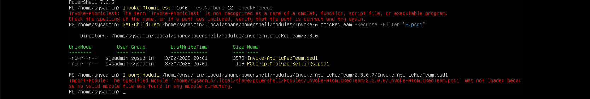
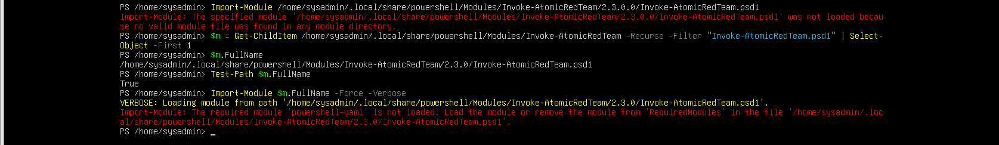
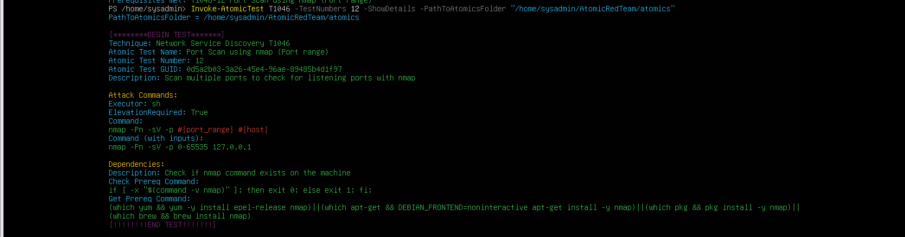
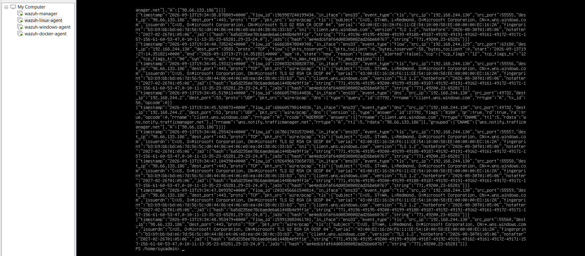
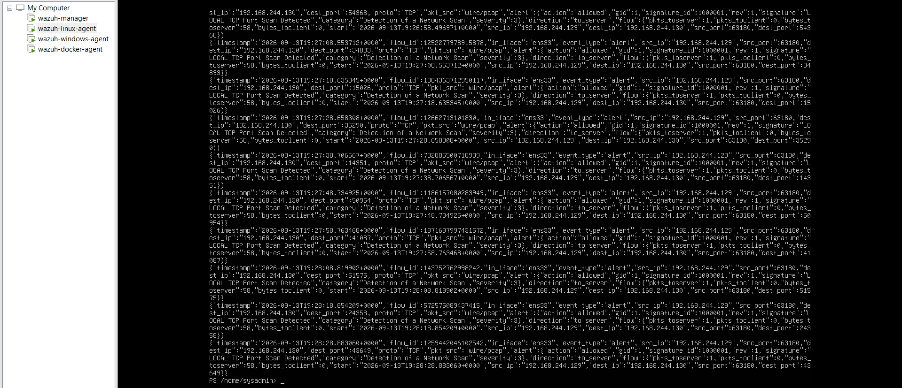
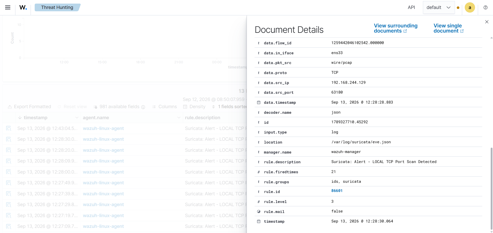
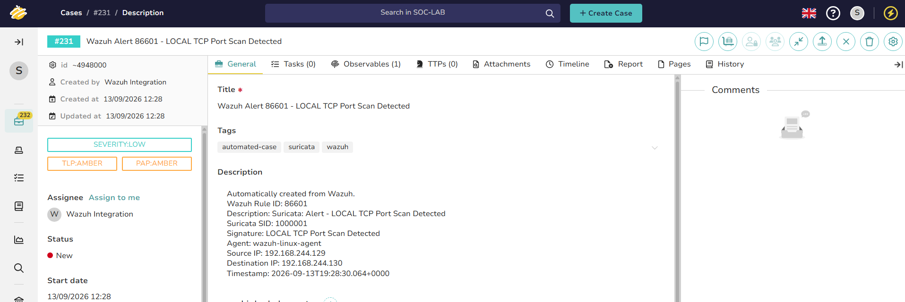
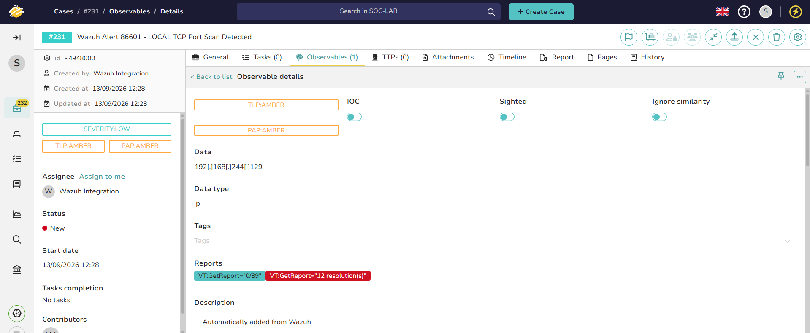

# T1046 — Network Service Scanning

## Test profile

| Field | Value |
| --- | --- |
| Tactic | Discovery |
| Atomic test | `T1046-12` — Port Scan using Nmap (port range) |
| Source | `wazuh-linux-agent` — `192.168.244.129` |
| Target | Windows endpoint — `192.168.244.130` |
| Port range | `1-1000` |
| Final result | **FULL-CHAIN PASS** |

Atomic's test command was based on:

```text
nmap -Pn -sV -p <port_ranges> <host>
```

## Prerequisite and elevation troubleshooting

The first prerequisite check reported that elevation was required and that Nmap needed to be available. Nmap was verified/installed, then the test was retried from elevated PowerShell.

This exposed three related environment boundaries:

1. `Invoke-AtomicRedTeam` had been installed with `-Scope CurrentUser` for `sysadmin`, so root PowerShell did not recognize `Invoke-AtomicTest`.
2. Importing the module manifest manually failed because root could not see the normal user's `powershell-yaml` dependency.
3. Once the modules were imported, Atomic defaulted to `/root/AtomicRedTeam/atomics`, while the actual repository was `/home/sysadmin/AtomicRedTeam/atomics`.

The normal user's PowerShell module path was made available to the elevated session, both modules were imported, and the actual Atomics path was supplied explicitly. The prerequisite check then passed.








## Execution result

The Atomic Nmap process reached its default 120-second timeout. This did not invalidate the test: the scan had already generated network traffic, so detection was evaluated independently of the wrapper's completion status.



## Suricata result

Suricata detected the scan using the Week 2 local signature:

```text
event_type:  alert
signature:   LOCAL TCP Port Scan Detected
signature_id: 1000001
category:    Detection of a Network Scan
src_ip:      192.168.244.129
dest_ip:     192.168.244.130
```



## Wazuh result

Wazuh collected `/var/log/suricata/eve.json` from `wazuh-linux-agent` and processed the alert as:

```text
rule.id:                 86601
rule.description:        Suricata: Alert - LOCAL TCP Port Scan Detected
data.alert.signature_id: 1000001
data.dest_ip:             192.168.244.130
location:                 /var/log/suricata/eve.json
```



## TheHive and Cortex result

The Week 3 integration was already routed for this port-scan workflow. Wazuh rule `86601` caused the integration to create:

```text
TheHive Case #231
Title: Wazuh Alert 86601 - LOCAL TCP Port Scan Detected
Created by: Wazuh Integration
Tags: automated-case, suricata, wazuh
```

The integration automatically added the source IP `192.168.244.129` as an observable. Cortex executed the VirusTotal analyzer and TheHive displayed enrichment tags including:

```text
VT:GetReport="12 resolution(s)"
VT:GetReport="0/89"
```





The private RFC1918 address is useful for workflow validation, not public reputation scoring.

## Final assessment

```text
Atomic T1046-12
  → Suricata SID 1000001
  → Wazuh Rule 86601
  → TheHive Case #231
  → automatic IP observable
  → Cortex / VirusTotal enrichment
```

**FULL-CHAIN PASS.** The timeout is recorded as an Atomic execution constraint, not a detection failure.

## Engineering takeaway

Attack-tool completion, telemetry generation, detection, SIEM ingestion, case routing, and enrichment are separate validation points. A failure or timeout at one control boundary should not be used to infer the state of every downstream boundary.
