# T1053.003 — Cron

## Test profile

| Field | Value |
| --- | --- |
| Tactic | Persistence |
| Atomic test | `T1053.003-1` — Cron: replace crontab with referenced file |
| Endpoint | `wazuh-linux-agent` |
| Command | `/tmp/evil.sh` |
| Final result | **PASS AFTER FIX** |

## Atomic execution

The prerequisite check passed and Atomic installed this Cron entry:

```cron
* * * * * /tmp/evil.sh
```

Linux generated fresh events each minute:

```text
CRON[...] (sysadmin) CMD (/tmp/evil.sh)
```


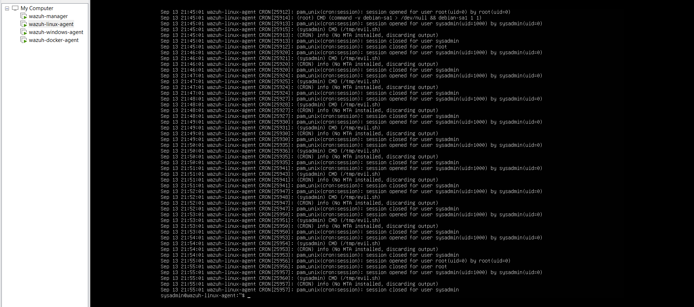

## Initial detection failure

Wazuh searches for `cron`, `crontab`, and `/tmp/evil.sh` returned no results. TheHive also showed no Cron case.

The host evidence proved the activity and usable telemetry existed. The Wazuh Agent and `wazuh-logcollector` were running, and the endpoint already had a journald collection block. This made the result more than an ordinary content gap: a pipeline stage needed to be isolated.

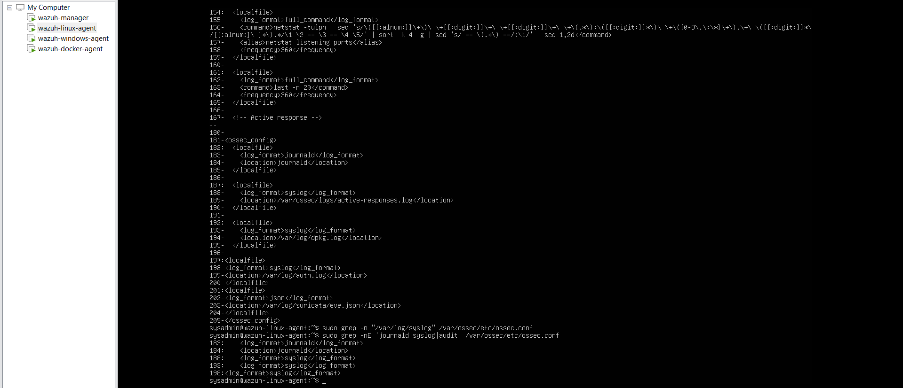

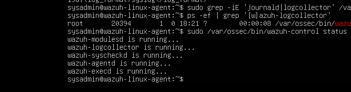

## Root-cause test

The exact host event was tested offline:

```text
Sep 13 22:19:01 wazuh-linux-agent CRON[26118]: (sysadmin) CMD (/tmp/evil.sh)
```

`wazuh-logtest` returned:

```text
Phase 1: Completed pre-decoding
program_name: CRON

Phase 2: Completed decoding
No decoder matched.
```

This was the decisive proof: pre-decoding recognized the program, but the event had no matching decoder, so no detection rule could evaluate the extracted user and command.


## Safe configuration changes

Before editing, the local decoder and rules files were backed up. Three minor command mistakes occurred and are retained in the troubleshooting record:

- an incorrect same-line backslash caused a malformed copy target,
- `local_decoders.xml` was typed instead of `local_decoder.xml`,
- a wildcard expanded before `sudo`, so the unprivileged shell could not list the protected directory.

Explicit filenames were then used to verify both originals and backups.


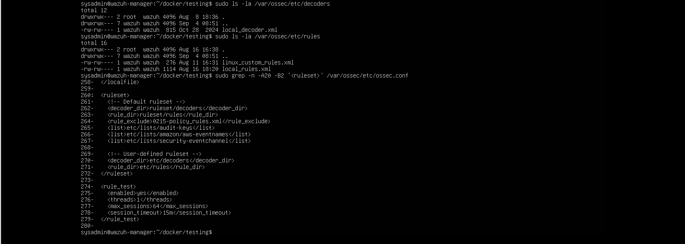

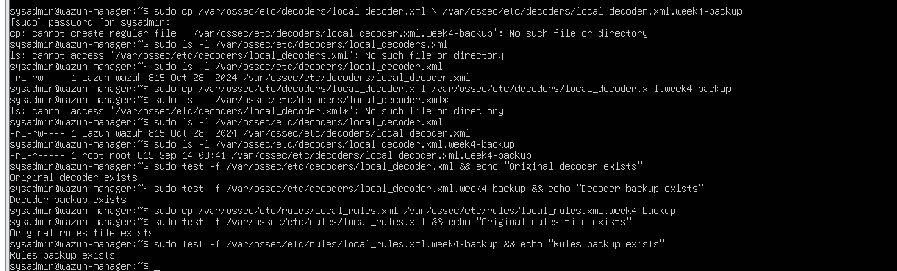

## Fix 1 — dedicated decoder

A `cron-service` decoder was added for `CRON` program events. It extracts:

```text
service_user
command
```

For the Atomic event, the extracted values were:

```text
service_user: sysadmin
command: /tmp/evil.sh
```

See [cron-decoder.md](../detection-engineering/cron-decoder.md).


## Fix 2 — MITRE-mapped rule

Custom rule `111801` was added at level `8` and mapped to `T1053.003`. Its description retained the extracted user, command, and hostname.

See [cron-rule-111801.md](../detection-engineering/cron-rule-111801.md).

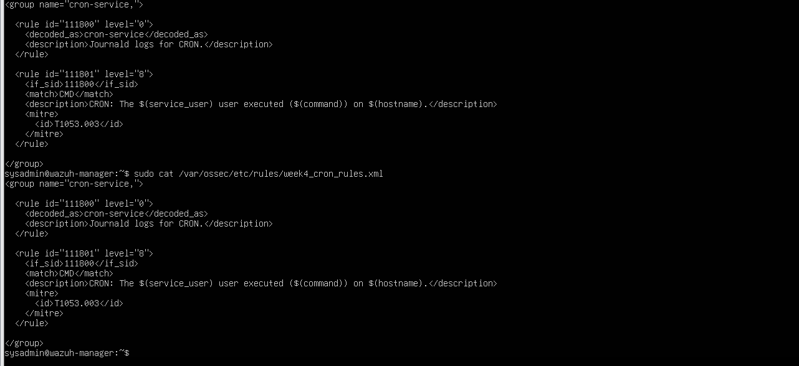

## Offline validation after the decoder/rule fix

The same log line now produced:

```text
Phase 2
name: cron-service
command: /tmp/evil.sh
service_user: sysadmin

Phase 3
id: 111801
level: 8
MITRE: T1053.003
Alert to be generated.
```

`wazuh-analysisd -t` also produced warnings about pre-existing malicious IOC lists and rules in the `9990x` range. These warnings were unrelated to the Cron decoder/rule, and no Cron XML syntax error was reported.


## Live-collection investigation

Rule `111801` later fired live for `wazuh-docker-agent`. That proved the decoder, rule, and manager analysis engine worked, but did not yet prove that the Atomic endpoint was forwarding its Cron events.

On `wazuh-linux-agent`, journald collection, agent health, and fresh post-restart Cron events were confirmed, but the manager still had no `/tmp/evil.sh` event from that agent. Centralized `agent.conf` was checked and no relevant override was found.

`/var/log/syslog` was then identified as the reliable live source containing current Cron events. It was not present in the Linux agent's monitored `<localfile>` blocks.

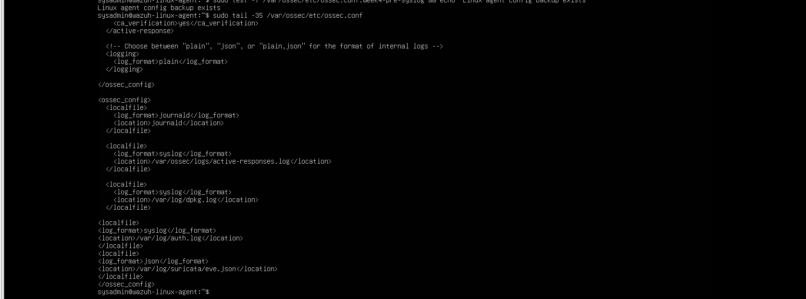

## Fix 3 — explicit syslog collection

The endpoint received:

```xml
<localfile>
  <log_format>syslog</log_format>
  <location>/var/log/syslog</location>
</localfile>
```

The agent configuration was validated and the Wazuh Agent was restarted.

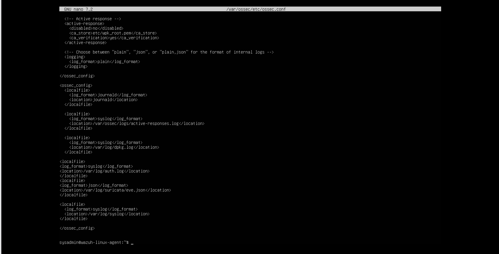

## Live success

Manager `alerts.json` and Wazuh dashboard details then showed live events from `wazuh-linux-agent`:

```text
rule.id:        111801
rule.level:     8
decoder.name:   cron-service
service_user:   sysadmin
command:        /tmp/evil.sh
rule.mitre.id:  T1053.003
```

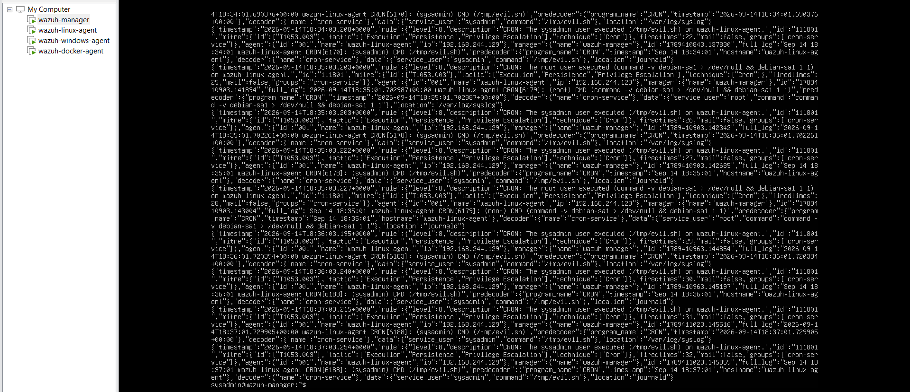

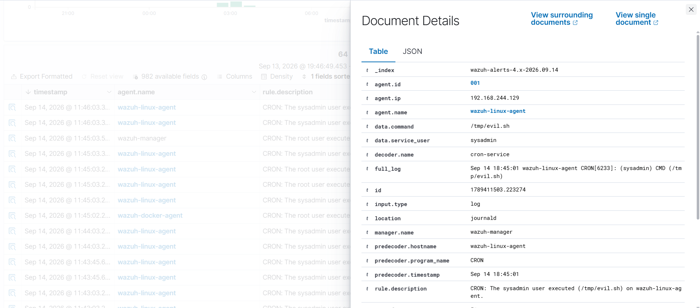

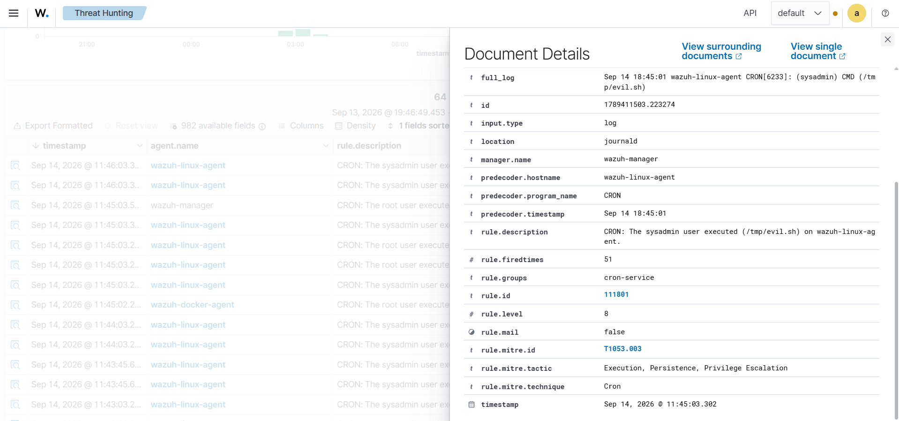

**PASS AFTER FIX.** The project corrected both the analysis gap and the missing reliable live collection path.

## TheHive interpretation

No Cron case was created after the Wazuh fix. This did not invalidate the detection. The existing Week 3 integration was intentionally scoped to the Suricata port-scan flow under rule `86601`; rule `111801` was outside that routing policy.

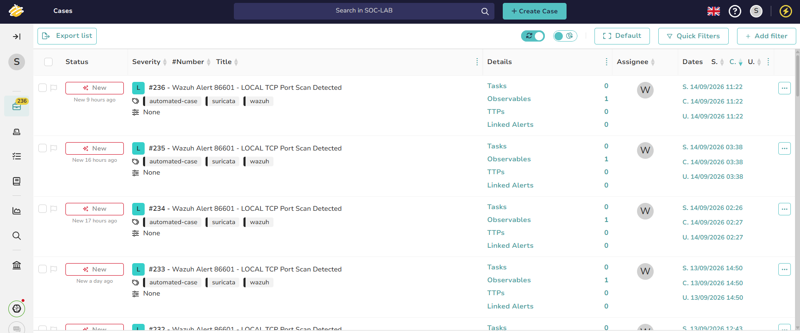

## Engineering takeaway

The investigation required two distinct validations:

1. **Offline analysis:** can Wazuh decode and match the exact log?
2. **Live collection:** does the correct endpoint forward the source that contains the event?

Passing only one is not enough to prove an operational detection.
