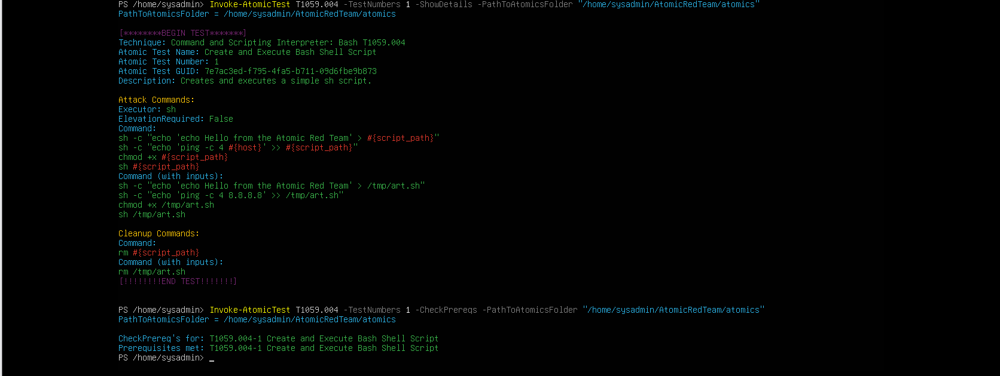
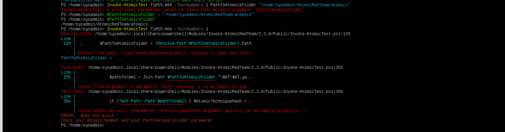
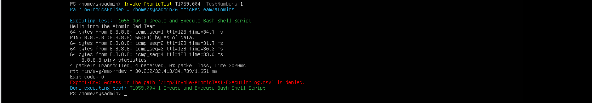
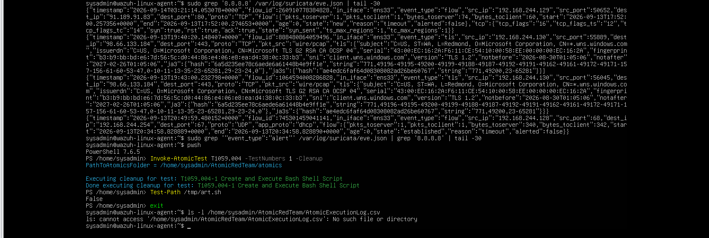
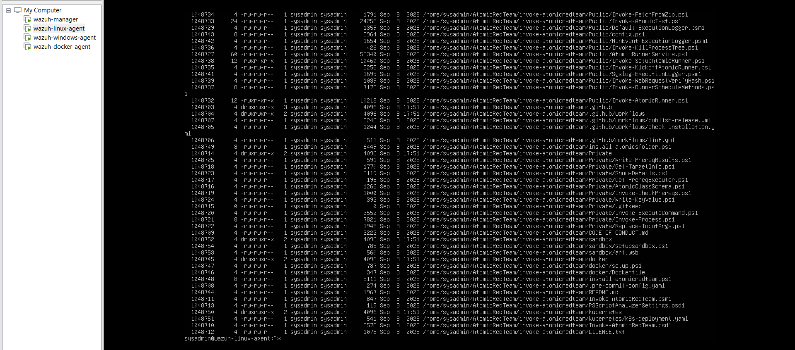
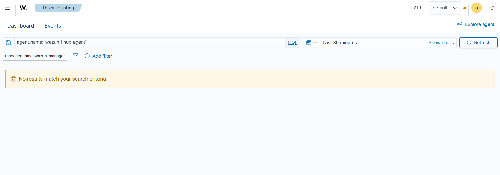
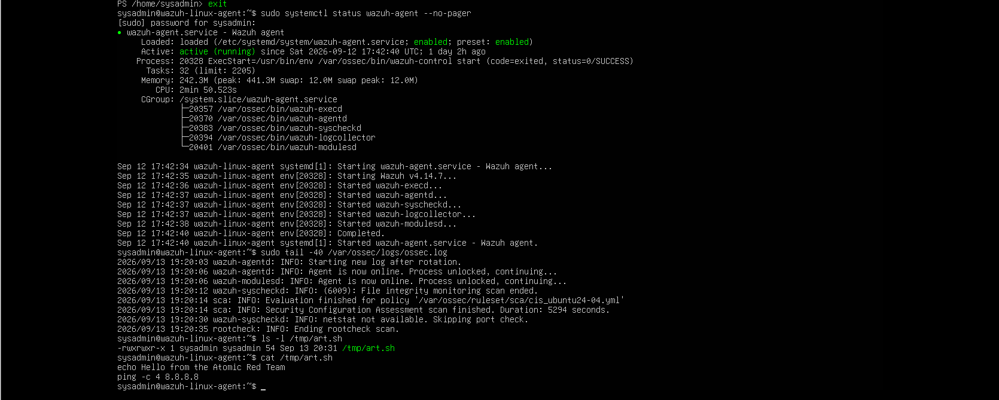
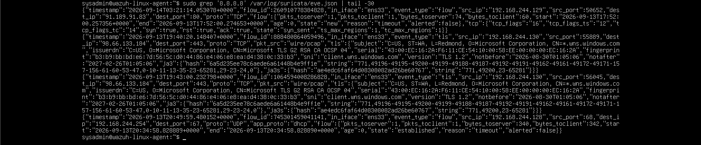

# T1059.004 — Unix Shell

## Test profile

| Field | Value |
| --- | --- |
| Tactic | Execution |
| Atomic test | `T1059.004-1` — Create and Execute Bash Shell Script |
| Endpoint | `wazuh-linux-agent` |
| Artifact | `/tmp/art.sh` |
| Final result | **COVERAGE GAP** |

## Invocation troubleshooting

The first command supplied `-PathToAtomicsFolder` in a form that PowerShell parsed as an unexpected positional argument. The command was also run from the elevated environment, where `$HOME` was `/root` and Atomic again searched under `/root/AtomicRedTeam/atomics`.

The resolution was to leave root PowerShell, verify:

```text
whoami = sysadmin
$HOME   = /home/sysadmin
```

and launch the normal user's PowerShell environment.



## Successful execution

Atomic then executed successfully:

```text
Executing test: T1059.004-1 Create and Execute Bash Shell Script
HELLO from the Atomic Red Team
Exit code: 0
```

The host artifact `/tmp/art.sh` was confirmed to exist and contain the expected test script.





## Atomic logging permission issue

Atomic also reported that access to `/tmp/Invoke-AtomicTest-ExecutionLog.csv` was denied. Inspection showed:

```text
owner: root
group: root
mode:  0644
```

An earlier elevated Atomic operation had created the shared execution log as root. The targeted fix was:

```bash
sudo chown sysadmin:sysadmin /tmp/Invoke-AtomicTest-ExecutionLog.csv
```

Writability was then verified. This was an Atomic tooling/logging problem, not the Week 4 SOC pipeline defect.





## Detection checks

### Wazuh

Wazuh returned no relevant result after:

- widening the time range,
- confirming the Wazuh Agent was active,
- confirming `/tmp/art.sh` existed,
- confirming the Atomic returned exit code `0`.





### Suricata

Suricata observed related network traffic, including traffic associated with `8.8.8.8`, but no malicious alert fired. This was reasonable: ordinary ICMP traffic generated by a script is not automatically malicious.



### TheHive

No case was created because there was no qualifying Wazuh alert and the existing bridge was not a general host-execution router.

## Final assessment

**COVERAGE GAP.** The action executed successfully, but the current Linux telemetry and Wazuh rules did not expose shell/process execution in a way that produced an alert.

## Recommended improvement

Add `auditd` or equivalent Linux process-execution telemetry, then build detections around process ancestry, script creation and execution, command-line content, and unusual interpreter behavior. The detection should be validated against normal administrative shell use to control false positives.
