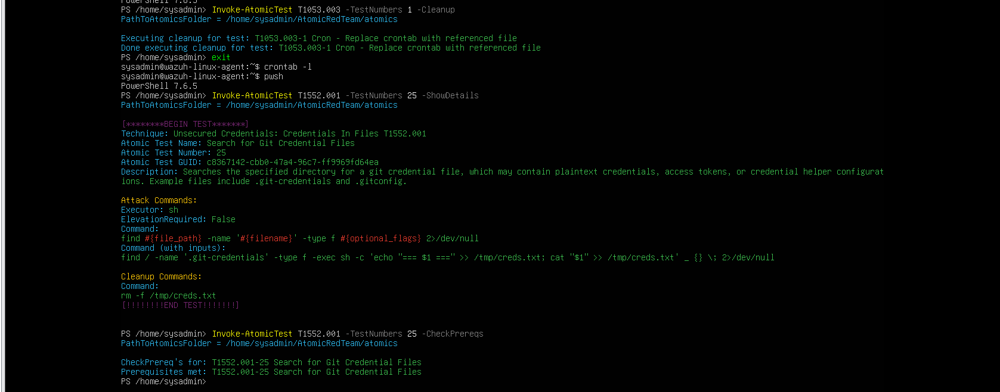

# T1552.001 — Credentials In Files

## Test profile

| Field | Value |
| --- | --- |
| Tactic | Credential Access |
| Atomic test | `T1552.001-25` — Search for Git Credential Files |
| Test directory | `/tmp/atomic-git-creds-test` |
| Final result | **COVERAGE GAP** |

## Safety decision

The Atomic can read `.git-credentials` content. To prevent exposure of real secrets, the test used only an isolated dummy file:

```text
/tmp/atomic-git-creds-test/.git-credentials
```

It contained fake values only, and the Atomic search path was restricted to `/tmp/atomic-git-creds-test` rather than `/`.

No real credential, token, cookie, API key, or authentication header is included in this repository.




## Execution

Atomic `T1552.001-25` completed successfully:

```text
Executing test: Search for Git Credential Files
Exit code: 0
```

The test artifacts were cleaned up afterward.


## Detection result

- **Wazuh:** no relevant alert.
- **Suricata:** not applicable; the behavior was a local filesystem search.
- **TheHive:** no case was expected without a qualifying Wazuh alert.

## Final assessment

**COVERAGE GAP.** The current endpoint telemetry and rules do not alert on this credential-file discovery behavior.

## Recommended improvement

Evaluate process-execution telemetry for commands searching known credential paths, then combine it with carefully selected sensitive-path monitoring and context-aware rules. Avoid logging or publishing the contents of real credential files during validation.
