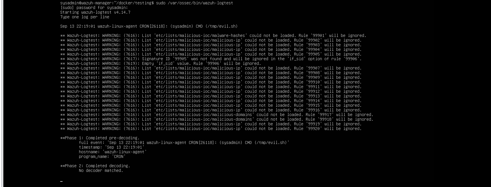
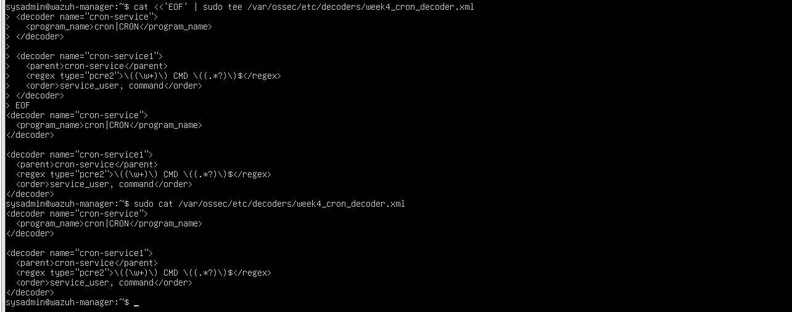
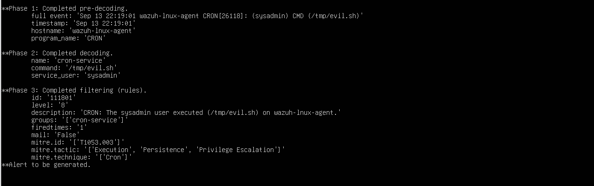

# Cron Decoder — `cron-service`

## Why a custom decoder was required

The Atomic Cron test produced a valid host event:

```text
Sep 13 22:19:01 wazuh-linux-agent CRON[26118]: (sysadmin) CMD (/tmp/evil.sh)
```

Before the change, `wazuh-logtest` completed pre-decoding and identified `program_name: CRON`, but Phase 2 reported:

```text
No decoder matched.
```



Without decoded fields, the custom detection could not reliably identify the executing user and command.

## Sanitized decoder

The dedicated local decoder matches the `CRON` program and extracts the user and command from the message body:

```xml
<decoder name="cron-service">
  <program_name>cron|CRON</program_name>
</decoder>

<decoder name="cron-service1">
  <parent>cron-service</parent>
  <regex type="pcre2">^\((\w+)\) CMD \((.*)\)$</regex>
  <order>service_user,command</order>
</decoder>
```

The reusable XML is available at [decoders/cron-service-decoder.xml](../decoders/cron-service-decoder.xml).



For the Atomic event, the expected decoded values are:

```text
service_user: sysadmin
command: /tmp/evil.sh
```

## Validation

The exact same log line was rerun through `wazuh-logtest`. Phase 2 then reported:

```text
name: cron-service
service_user: sysadmin
command: /tmp/evil.sh
```

Phase 3 subsequently matched rule `111801` and reported that an alert would be generated.



## Deployment note

The deployed decoder belonged in Wazuh's local decoder configuration. Existing files were backed up before editing. Environment-specific file ownership and permissions must be retained when deploying local Wazuh configuration.

## Boundary of this fix

The decoder repaired analysis of a Cron log once Wazuh received it. A separate live-collection problem still had to be solved by explicitly monitoring `/var/log/syslog` on `wazuh-linux-agent`.
