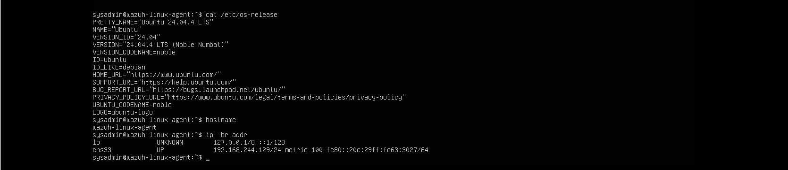
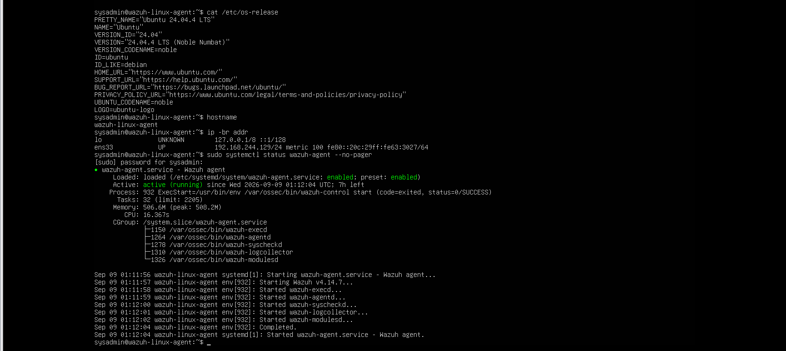
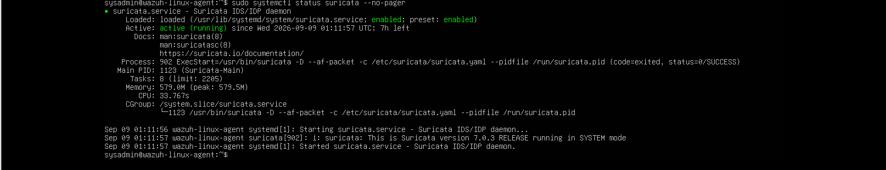
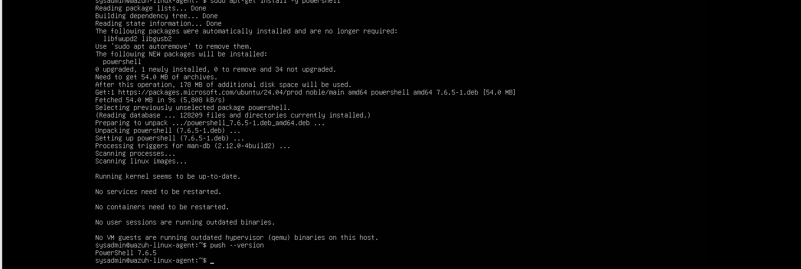
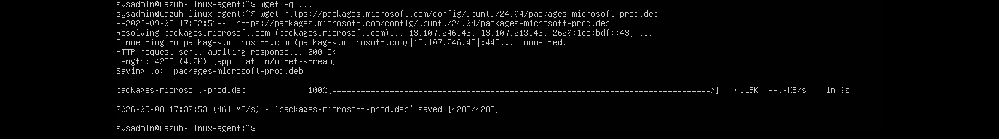
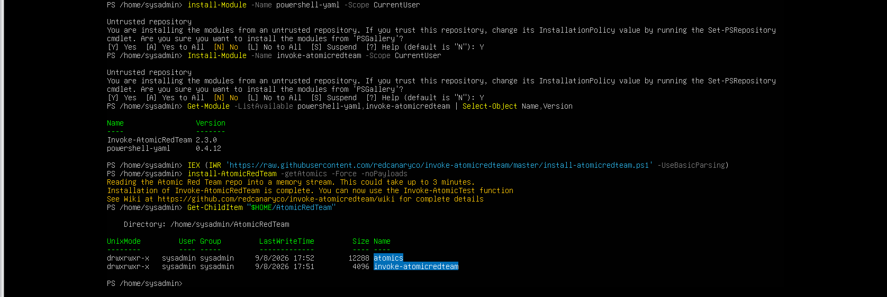
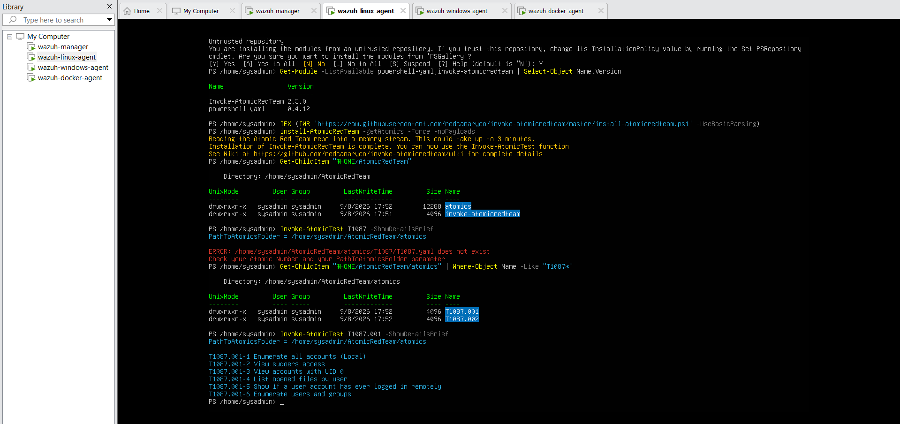
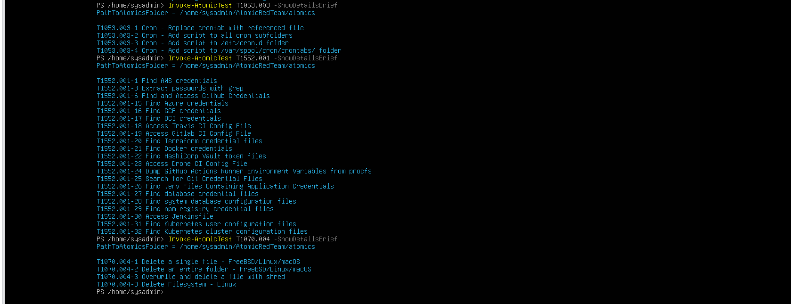

# Week 4 Setup and Safe Testing

## Snapshot and known-good baseline

Before attack simulation, the Linux endpoint was snapshotted as:

```text
Pre-Week4-Atomic-Linux
```

This preserved the completed Weeks 1–3 state and provided a recovery point before installing an adversary-emulation framework.



The pre-attack baseline confirmed:

```text
OS:          Ubuntu 24.04.4 LTS
hostname:    wazuh-linux-agent
address:     192.168.244.129
wazuh-agent: active (running)
suricata:    active (running)
```





## PowerShell installation

Atomic's PowerShell framework required PowerShell Core on Linux. The final installed version was:

```text
PowerShell 7.6.5
```



### Repository-package download issue

The first attempt to install `packages-microsoft-prod.deb` failed because the archive was not present:

```text
dpkg: error: cannot access archive 'packages-microsoft-prod.deb':
No such file or directory
```

Connectivity to `packages.microsoft.com` was checked. The download was then retried without quiet mode using the explicit Ubuntu 24.04 URL and completed with HTTP `200 OK` and a saved 4,288-byte package.

The evidence does not establish one exclusive cause for the missing initial download. It is documented only as:

```text
archive missing → connectivity checked → explicit download retried → download succeeded
```




## PowerShell module installation

The first combined command produced:

```text
Install-Module: A positional parameter cannot be found that accepts argument 'powershell-yaml'
```

The dependencies were installed separately:

```powershell
Install-Module -Name powershell-yaml -Scope CurrentUser
Install-Module -Name invoke-atomicredteam -Scope CurrentUser
```

Verification showed:

```text
Invoke-AtomicRedTeam  2.3.0.0
powershell-yaml       0.4.12
```


## Atomic Red Team installation

Atomic Red Team was installed under:

```text
/home/sysadmin/AtomicRedTeam
```

The following directories were verified:

```text
atomics
invoke-atomicredteam
```



## Parent and sub-technique lookup

The first content check used:

```powershell
Invoke-AtomicTest T1087 -ShowDetailsBrief
```

It failed because the installation did not contain `T1087/T1087.yaml`. The Atomics were stored under sub-techniques. After inspecting the available paths, `T1087.001` loaded successfully.

This was a content-selection/path issue, not a detection-pipeline failure.




## Selected techniques

The five chosen technique folders were verified before testing:

| Technique | Atomic | Tactic |
| --- | --- | --- |
| T1046 | T1046-12 | Discovery |
| T1059.004 | T1059.004-1 | Execution |
| T1053.003 | T1053.003-1 | Persistence |
| T1552.001 | T1552.001-25 | Credential Access |
| T1070.004 | T1070.004-1 | Defense Evasion |



## Safety controls

- Tests were limited to the isolated VMware lab.
- A snapshot existed before tooling installation.
- The T1552 test used only fake credentials in a dedicated temporary directory.
- The credential search was scoped to that directory rather than the filesystem root.
- Secrets, session material, and real authentication data are not included in the repository.
- A missing alert was allowed to remain a documented gap when changing scope solely to make the test green would distort the result.
