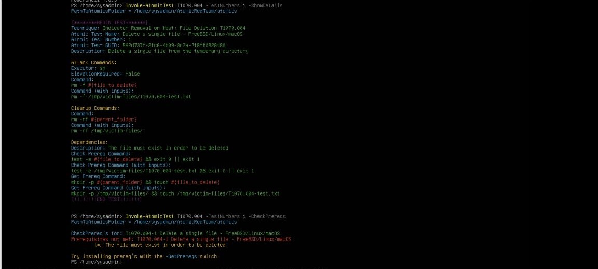
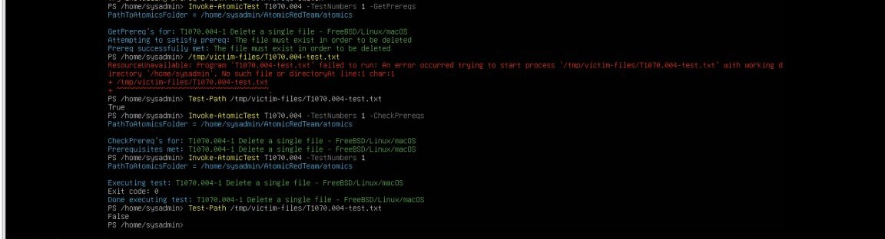
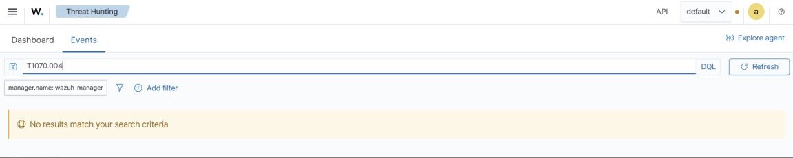
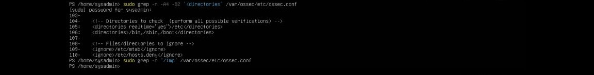

# Week 4 Troubleshooting

This chronology preserves both major and minor problems because the project evaluated the engineering process, not only the final detections.

## 1. Microsoft repository package was missing

### Problem

`dpkg` could not access `packages-microsoft-prod.deb` because the file did not exist locally.

### Investigation

Connectivity to `packages.microsoft.com` was checked. The package was downloaded again with visible output and the explicit Ubuntu 24.04 URL.

### Result

The server returned HTTP `200 OK`, and the 4,288-byte package was saved successfully.

### Evidence boundary

The initial failure's exact cause was not proven. The project does not label it as DNS, network, or command error without evidence.


### Lesson

When a local installer says an archive is missing, first verify the artifact rather than debugging the package manager itself.

## 2. Combined module installation command failed

### Problem

The first module command returned:

```text
A positional parameter cannot be found that accepts argument 'powershell-yaml'
```

### Fix

Install the modules separately:

```powershell
Install-Module -Name powershell-yaml -Scope CurrentUser
Install-Module -Name invoke-atomicredteam -Scope CurrentUser
```

### Validation

`Invoke-AtomicRedTeam 2.3.0.0` and `powershell-yaml 0.4.12` were listed successfully.


## 3. Parent ATT&CK technique path did not exist

### Problem

`Invoke-AtomicTest T1087 -ShowDetailsBrief` reported that `T1087/T1087.yaml` did not exist.

### Root cause

The repository stored content under sub-technique paths, not the parent technique path.

### Fix

Available folders were checked and `T1087.001` was used successfully.

### Classification

Setup/test-selection issue—not a SOC pipeline failure.


## 4. T1046 prerequisite and elevated PowerShell problems

### Initial prerequisite failure

Atomic reported that prerequisites were not met, elevation was required, and Nmap needed to exist. Nmap was verified/installed.

### Root module visibility

The modules had been installed for `sysadmin` using `-Scope CurrentUser`. In `sudo pwsh`, root returned:

```text
Invoke-AtomicTest: The term 'Invoke-AtomicTest' is not recognized
```

### Dependency failure

Manual import of the Invoke-AtomicRedTeam manifest then failed because root could not see `powershell-yaml` in the normal user's module path.

### Atomics path failure

After the modules were imported, root defaulted to:

```text
/root/AtomicRedTeam/atomics
```

The repository was actually located at:

```text
/home/sysadmin/AtomicRedTeam/atomics
```

### Fix

The normal user's module path was added to `PSModulePath`, both dependencies were imported, and the Atomics path was supplied explicitly. The T1046 prerequisite check then passed.


### Lesson

Elevation changes `$HOME`, module scope, dependency discovery, and default content paths. Treat the elevated shell as a different runtime environment.

## 5. T1046 timed out after 120 seconds

### Problem

The Atomic Nmap process timed out after 120 seconds.

### Investigation

Suricata, Wazuh, TheHive, and Cortex were checked independently.

### Result

The traffic had already been generated and produced the complete detection and enrichment chain: Suricata SID `1000001`, Wazuh rule `86601`, TheHive Case `#231`, automatic observable, and VirusTotal tags.


### Lesson

Do not equate an execution wrapper timeout with a detection failure. Validate the telemetry and downstream controls directly.

## 6. T1059 command parameter and root-home conflict

### Problem

The initial command produced a positional-parameter error for `PathToAtomicsFolder`. It was also executed in root PowerShell, causing Atomic to look under `/root/AtomicRedTeam/atomics`.

### Fix

Exit the elevated shell, verify `whoami = sysadmin` and `$HOME = /home/sysadmin`, then use normal PowerShell.

### Result

`T1059.004-1` ran successfully, printed `HELLO from the Atomic Red Team`, returned exit code `0`, and created `/tmp/art.sh`.


## 7. Atomic execution log was root-owned

### Problem

Atomic reported:

```text
Access to the path '/tmp/Invoke-AtomicTest-ExecutionLog.csv' is denied
```

### Investigation

The file was owned by `root:root` with mode `0644`. A prior elevated Atomic run had created the shared log.

### Fix

```bash
sudo chown sysadmin:sysadmin /tmp/Invoke-AtomicTest-ExecutionLog.csv
```

Writability was verified afterward.


### Classification

Atomic tooling/logging issue—not the Task 24 SOC pipeline bug.

## 8. T1059 executed but Wazuh did not detect it

### Evidence checked

- Atomic returned exit code `0`.
- `/tmp/art.sh` existed and contained the script.
- The Wazuh Agent was healthy.
- The Wazuh search time range was widened.
- Suricata saw related traffic but no malicious alert.

### Result

Wazuh returned no relevant result, and no TheHive case existed.

### Classification

Legitimate coverage gap caused by insufficient Linux process/shell execution telemetry.

### Recommendation

Add `auditd` or equivalent process telemetry, then develop and tune execution detections.


## 9. T1053 host telemetry existed but Wazuh had no alert

### Problem

Atomic created `* * * * * /tmp/evil.sh`, and Linux logs repeatedly recorded `CRON[...] (sysadmin) CMD (/tmp/evil.sh)`. Wazuh searches still returned no result.

### Checks

- `wazuh-agent` running.
- `wazuh-logcollector` running.
- journald collection configured.
- manager custom decoder/rule directories present.
- no Cron case in TheHive.

### Interpretation

The host produced relevant telemetry. The next question was whether Wazuh could decode it.


## 10. `wazuh-logtest` proved no Cron decoder matched

### Test

```text
Sep 13 22:19:01 wazuh-linux-agent CRON[26118]: (sysadmin) CMD (/tmp/evil.sh)
```

### Result before the fix

```text
Phase 1: Completed pre-decoding
program_name: CRON

Phase 2: Completed decoding
No decoder matched.
```

### Root cause

Wazuh recognized the syslog program but had no decoder for the Cron message structure. The user and command were therefore unavailable to a dedicated rule.

### Fix

Add the `cron-service` decoder and level-8 rule `111801` mapped to `T1053.003`.


## 11. Backup-stage command mistakes

Backups were created before modifying Wazuh, but three small command problems occurred:

1. A backslash was used incorrectly on the same line, producing a malformed target and `No such file or directory`.
2. `local_decoders.xml` was typed instead of the actual `local_decoder.xml` filename.
3. `sudo ls ... local_decoder.xml*` failed because the shell expanded the wildcard before `sudo`, while the normal user could not list the protected directory.

Explicit filenames were used to verify the original decoder, decoder backup, original rules file, and rules backup.


### Lesson

Privilege applies to the command, not to shell expansion that happens before it. For protected paths, explicit filenames are safer and easier to audit.

## 12. Cron decoder and rule passed offline validation

After the changes, the same event produced:

```text
decoder.name: cron-service
command: /tmp/evil.sh
service_user: sysadmin
rule.id: 111801
rule.level: 8
MITRE: T1053.003
Alert to be generated.
```

`wazuh-analysisd -t` produced warnings about pre-existing malicious IOC lists and rules in the `9990x` range. Those warnings were unrelated to the Cron change and are not presented as a Cron failure.


## 13. Rule 111801 fired for the wrong evidence target first

### Observation

Manager `alerts.json` showed rule `111801` firing for `wazuh-docker-agent`.

### What this proved

- the custom decoder worked live,
- rule `111801` worked live,
- the manager analysis engine was healthy.

### What it did not prove

It did not prove that `wazuh-linux-agent`, the Atomic endpoint, was forwarding its Cron event.

### Lesson

Always confirm the originating agent before treating an alert as proof of the intended test.

## 14. Linux Cron events still did not reach the manager

### Endpoint checks

- hostname `wazuh-linux-agent` confirmed,
- journald collection present,
- agent and logcollector running,
- fresh Cron events generated after restart,
- no matching `/tmp/evil.sh` alert from that agent,
- no centralized `agent.conf` override found.

### Reliable source identified

`/var/log/syslog` contained current `CRON[...] (sysadmin) CMD (/tmp/evil.sh)` events, but it was not included in the endpoint's `<localfile>` blocks.

### Fix

```xml
<localfile>
  <log_format>syslog</log_format>
  <location>/var/log/syslog</location>
</localfile>
```

The agent configuration was validated and the service restarted.

### Live result

Wazuh then showed live events from `wazuh-linux-agent` with decoder `cron-service`, rule `111801`, level `8`, user `sysadmin`, command `/tmp/evil.sh`, and MITRE `T1053.003`.


### Task 24 status

This was the official Week 4 pipeline bug found and fixed.

## 15. T1053 did not create a TheHive case

### Observation

The live Wazuh detection succeeded, but no Cron case appeared in TheHive.

### Explanation

The Week 3 bridge remained scoped to the port-scan/rule `86601` workflow. Rule `111801` was outside that routing policy.

### Classification

Integration-scope limitation—not detection failure.


## 16. T1552 produced no detection

### Safety

A fake `.git-credentials` file was placed under `/tmp/atomic-git-creds-test`, and the search was restricted to that directory.

### Result

Atomic returned exit code `0`; Wazuh produced no relevant alert.

### Classification

Legitimate credential-discovery coverage gap. Suricata and TheHive were not expected to produce results without network or Wazuh detection.


## 17. T1070 prerequisite file was missing

### Problem

The first prerequisite check reported that `/tmp/victim-files/T1070.004-test.txt` had to exist. The first prerequisite-creation attempt did not leave the expected file in place.

### Fix

The file's existence was checked directly and the prerequisite was prepared until Atomic reported that prerequisites were met.

### Result

Atomic deleted the file, returned exit code `0`, and `Test-Path` returned `False`.






## 18. T1070 was outside FIM scope

### Investigation

Wazuh produced no alert. The endpoint's FIM configuration monitored `/etc`, `/usr/bin`, `/usr/sbin`, and `/boot`, but not `/tmp`.

### Classification

Legitimate monitoring-scope gap.

### Decision

Do not expand `/tmp` monitoring simply to make the test green. Evaluate specific high-risk temporary paths, exclusions, and expected event volume before changing production FIM scope.





## Final troubleshooting model

```text
Did the Atomic execute?
      ↓
Did the host or network record the activity?
      ↓
Did the relevant sensor collect it?
      ↓
Could Wazuh decode it?
      ↓
Did a rule match?
      ↓
Did the event come from the intended agent?
      ↓
Was TheHive routing expected for that rule?
```

This sequence prevented normal coverage gaps, tooling problems, analysis failures, collection failures, and integration-scope limits from being collapsed into one generic “no alert” conclusion.
