# Week 5 — SOAR Automation and Analyst Handoff

## Overview

Week 5 moved the lab from detection and case-management work into security orchestration. A new Shuffle SOAR virtual machine received real Wazuh alerts, filtered selected higher-value events, delivered readable Slack notifications, enriched file hashes with VirusTotal, and routed each lookup to an analyst-facing result.

The final validated playbook was:

```text
Wazuh alert
    ↓
Shuffle webhook
    ↓
Wazuh level > 6 AND rule ID != 111801
    ├── Initial Slack security alert
    └── VirusTotal lookup of syscheck.sha256_after
            ├── HTTP 200 → Slack Enrichment + analysis statistics
            └── HTTP 404 → Slack Not Found + no-record explanation
```

The build was not a straight-line success. It included Shuffle deployment problems, app-loading failures, Orborus and worker instability, Docker networking investigations, Wazuh integration connection failures, Slack formatting iterations, and VirusTotal connectivity work. Those failures and fixes are part of the engineering result and are preserved in [troubleshooting.md](./documentation/troubleshooting.md).

## Objectives

- Deploy a dedicated Shuffle SOAR node in the existing security lab.
- Prove the webhook manually before introducing Wazuh.
- Send a real Wazuh alert into Shuffle.
- Route selected alerts to Slack in a clean analyst-readable format.
- Filter high-value events with explicit conditions.
- Enrich the FIM field `syscheck.sha256_after` through VirusTotal.
- Treat a VirusTotal 404 as an expected unknown-hash outcome, not a broken integration.
- Validate both the 404 and 200 routes end to end.
- Produce an analyst handoff with operating steps, limitations, and recommendations.

## Existing lab context and new Shuffle VM

The Week 5 work extended the lab from Weeks 1–4. Wazuh continued to provide endpoint telemetry and detection; the new Shuffle VM added an orchestration layer; Slack became the analyst notification surface; and VirusTotal supplied file-hash reputation data.

| Component | Lab address | Week 5 role |
| --- | --- | --- |
| `wazuh-linux-agent` | `192.168.244.129` | FIM source and controlled test endpoint |
| Wazuh Manager | `192.168.244.128` | Alert analysis and Shuffle integration |
| Shuffle SOAR | `192.168.244.132` | Webhook receiver, filtering, enrichment, and routing |
| Slack `#soc-alerts` | SaaS | Analyst notification channel |
| VirusTotal API | SaaS | SHA-256 reputation lookup |

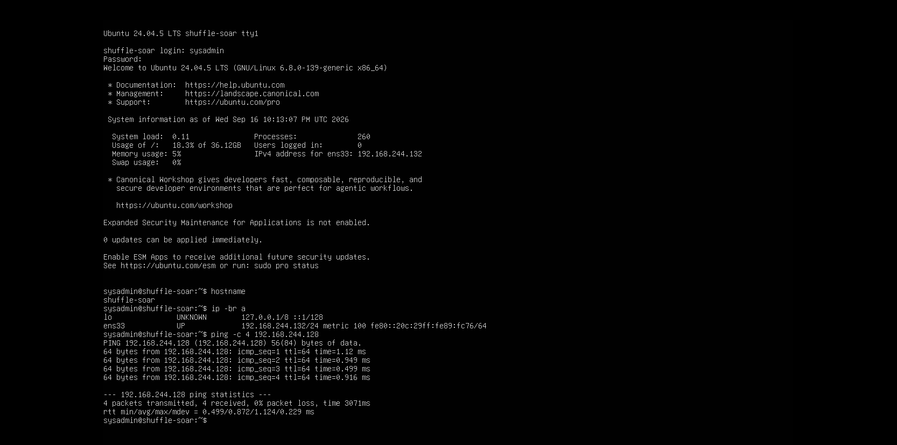

*The dedicated Ubuntu Shuffle VM was brought online and its local network baseline was verified before deployment.*

## Final architecture

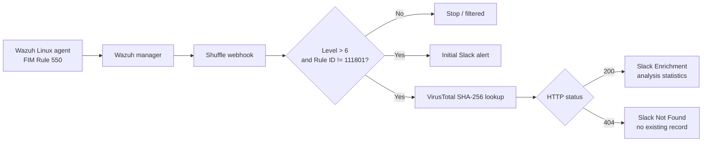

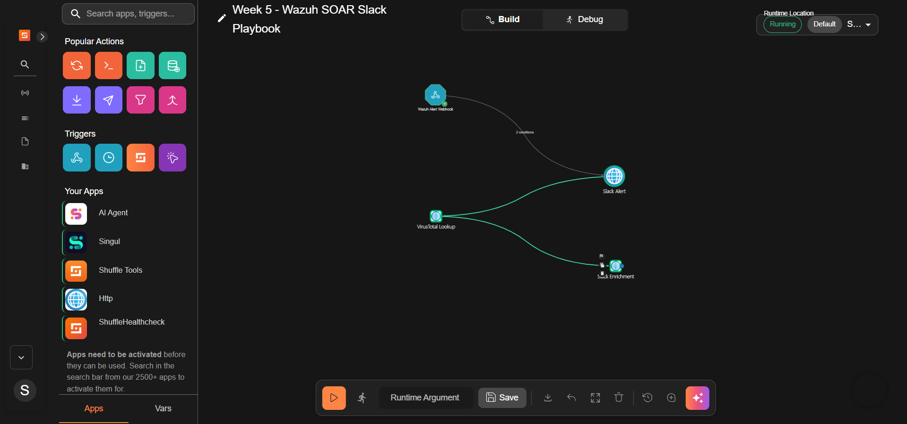

*The final playbook links the Wazuh webhook to the initial alert and the two VirusTotal result branches.*

Detailed diagrams and decision rules are in [architecture](./architecture/final-soar-architecture.md) and [playbook](./playbook/node-by-node.md).

## Task-by-task build

### Task 26 — Shuffle deployment and webhook validation

Docker was installed and validated, the Shuffle repository was cloned, and the OpenSearch prerequisite `vm.max_map_count` was configured. The core Shuffle containers eventually reached a usable state after runtime and worker-path troubleshooting.

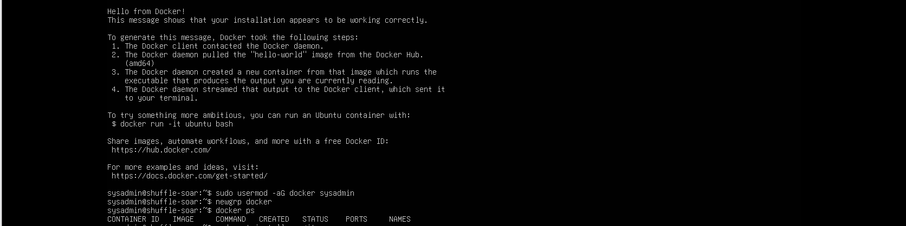

*Docker completed its standard validation run on the new SOAR host.*

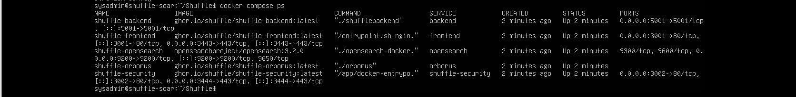

*The frontend, backend, Orborus, and OpenSearch-related containers were inspected during bring-up.*

The webhook was tested independently with a manual POST. The test returned HTTP `200` and an execution identifier; the resulting Shuffle execution finished with `TASK26_OK`. The raw terminal screenshot containing the live webhook identifier is deliberately excluded from this repository, while the safe execution result is retained below.

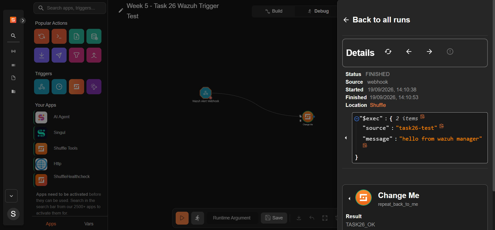

*The manually triggered webhook execution reached Shuffle and finished successfully.*

### Task 27 — Wazuh to Shuffle integration

The Wazuh manager integration was configured to forward JSON alerts to Shuffle. After restarting Wazuh and confirming `wazuh-integratord`, a real Linux-agent FIM event reached the playbook. The primary validated event was Rule `550`, **Integrity checksum changed**, for `/etc/week5_task26_final.txt`.

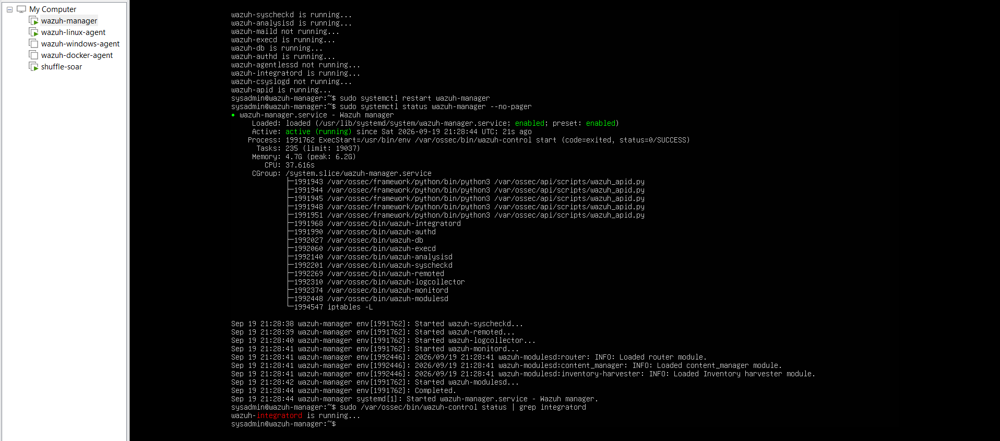

*The Wazuh manager was restarted and the integration process was checked after configuration.*

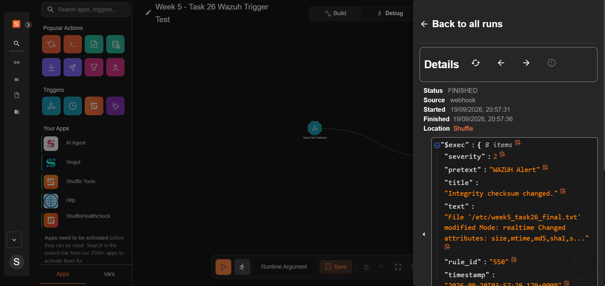

*A real FIM Rule 550 alert from `wazuh-linux-agent` arrived through the Shuffle webhook.*

### Task 28 — Slack integration and alert formatting

Slack delivery was first tested with simple placeholder content, then improved into a concise security alert. The final initial message showed the rule ID, Wazuh level, description, agent, agent IP, file path, and timestamp. Credential-bearing screenshots of the incoming-webhook URL were excluded.

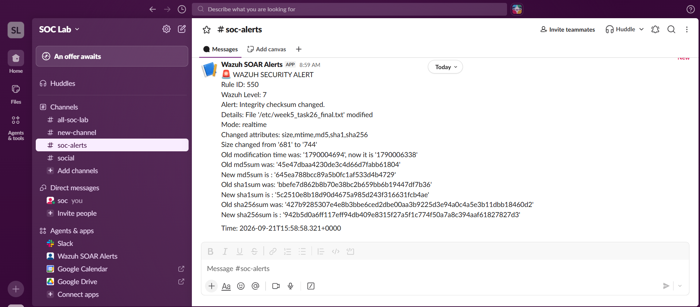

*The cleaned Slack message presents the Rule 550 event as an analyst-readable security alert.*

### Task 29 — Conditional routing

Early testing showed repeated Rule `111801` Cron events entering Slack. The branch was then constrained to:

```text
Wazuh alert level > 6
AND
Wazuh rule ID != 111801
```

This kept selected higher-value alerts moving while suppressing the demonstrated Cron noise in this branch. It is a lab-specific policy choice, not a claim that Rule `111801` is never useful.

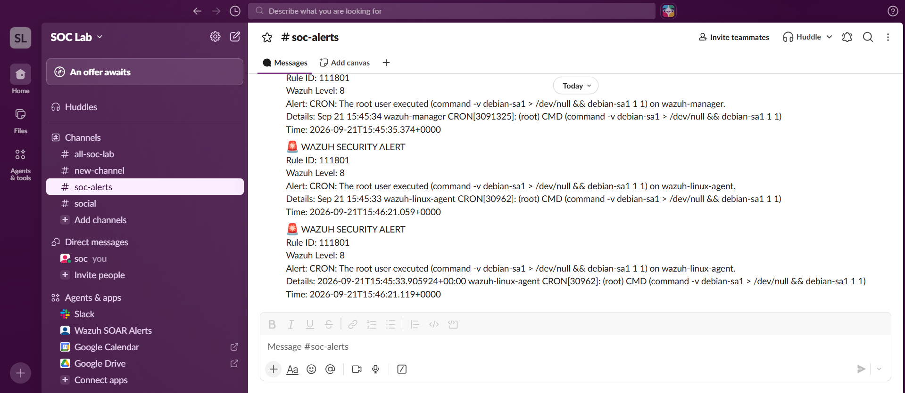

*Repeated Rule 111801 notifications provided the evidence for adding the exclusion.*

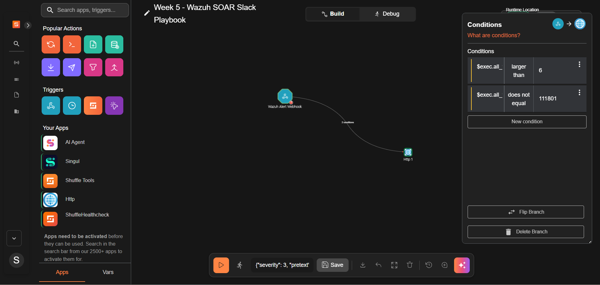

*The Shuffle branch requires a level greater than 6 and a rule ID other than 111801.*

### Task 30 — VirusTotal enrichment and two-way branching

The HTTP action queries the VirusTotal files endpoint with `syscheck.sha256_after`. The API key is supplied as a protected `x-apikey` header and is intentionally absent from this repository.

```text
GET https://www.virustotal.com/api/v3/files/<syscheck.sha256_after>
```

Two explicit result paths were implemented:

- HTTP `200`: the hash is known; send analysis statistics and a report link to **Slack Enrichment**.
- HTTP `404`: the hash has no existing VirusTotal record; send a clear **Slack Not Found** message.

#### Expected 404 / no-record branch

A unique custom file was written to the monitored path. Wazuh produced Rule `550`; VirusTotal returned `404 NotFoundError`; Shuffle routed the result to the no-record message.

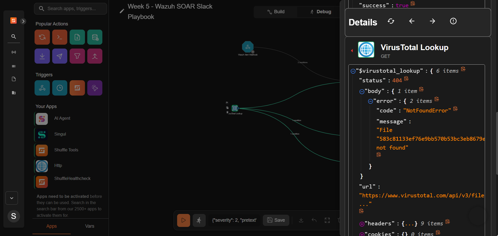

*The lookup completed successfully at the transport level and returned the expected API outcome: no record for this SHA-256.*

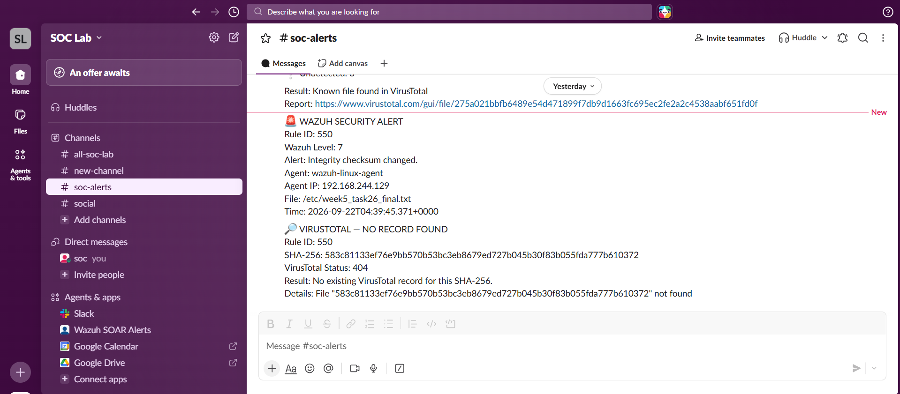

*Slack shows both the initial Rule 550 alert and the explicit VirusTotal no-record result.*

#### HTTP 200 / known-hash branch

The standard harmless EICAR antivirus test string was written to the monitored path. This generated another Rule `550`, and the resulting SHA-256 was known to VirusTotal. Shuffle received HTTP `200` and posted the analysis statistics to Slack.


*The standard EICAR antivirus test string was used as a benign validation artifact; no real malware was introduced.*

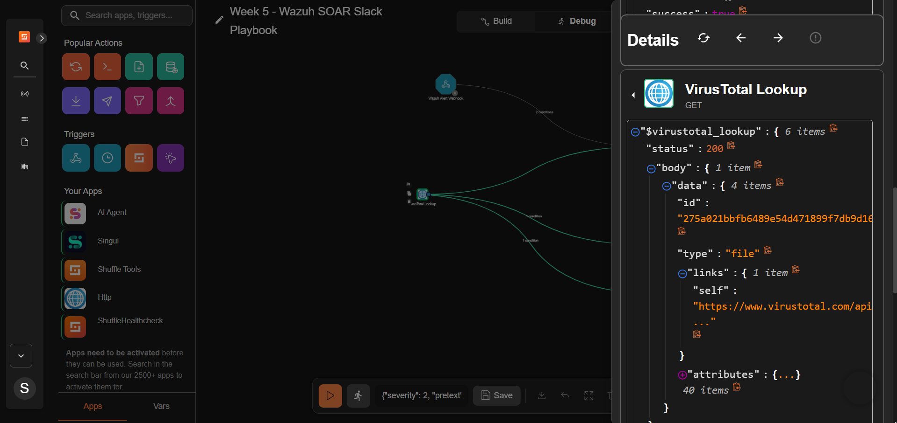

*The final run returned a known-file object from VirusTotal.*

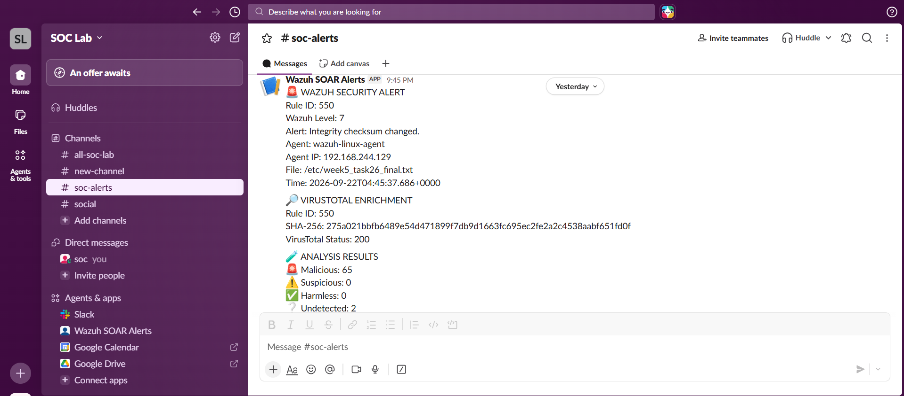

*The analyst-facing enrichment displays the HTTP 200 result and the observed engine statistics.*

VirusTotal verdict totals are dynamic. The final handoff screenshot recorded `65` malicious, `0` suspicious, `0` harmless, and `2` undetected at that moment; an earlier run showed a different malicious count. These are observations from specific runs, not permanent values.

### Task 31 — Analyst handoff

The completed handoff turns the build into an operating procedure. It describes the trigger, required fields, filters, node behavior, validation steps, analyst response, troubleshooting checks, current limitations, and recommended next changes.

See [analyst-handoff.md](./documentation/analyst-handoff.md).

## Important troubleshooting timeline

| Stage | Symptom | Investigation / recovery | Validation |
| --- | --- | --- | --- |
| Shuffle bootstrap | OpenSearch and dependent services did not stabilize immediately | Applied the `vm.max_map_count` prerequisite and inspected container state/logs | Core services became reachable |
| App availability | Required actions were unavailable or stuck loading | Tested app activation, `shuffle-tools` loading, and backend image build paths | Tool image build was observed |
| Execution runtime | Orborus/workers prepared or restarted repeatedly | Inspected Swarm state, worker/backend networks, runtime configuration, DNS, ports, and resources | Webhook executions later completed |
| Host resources | Soft-lockup and resource-pressure symptoms appeared | Checked memory, container consumption, and kernel messages | Runtime recovered sufficiently for stable tests |
| Wazuh delivery | Integration logs showed connection failures while Shuffle was unreachable | Checked endpoint reachability, restarted services, and retested after recovery | Real Rule 550 reached Shuffle |
| VirusTotal | Host/container DNS and outbound HTTPS behavior was inconsistent | Tested resolution and HTTPS separately from API lookup behavior | Actual 404 and 200 API results were later validated |
| Slack | Early messages were placeholders and later too noisy | Tested direct posting, formatted fields, then added conditions | Clean Rule 550 alerts and both enrichment outcomes arrived |

The complete chronological record is in [documentation/troubleshooting.md](./documentation/troubleshooting.md), with all safe supporting screenshots under [evidence](./evidence/README.md).

## Validation summary

| Task | Acceptance evidence | Status |
| --- | --- | --- |
| 26 | Shuffle deployed; manual webhook returned HTTP 200 and produced a finished execution | Complete |
| 27 | Real Wazuh FIM Rule 550 reached Shuffle | Complete |
| 28 | Direct Slack test and clean Wazuh security alert delivered | Complete |
| 29 | `level > 6` and `rule.id != 111801` conditional branch demonstrated | Complete |
| 30 | VirusTotal lookup routed both HTTP 404 and HTTP 200 to the correct Slack messages | Complete |
| 31 | Analyst operating procedure, troubleshooting, limitations, and recommendations documented | Complete |

See [tasks-26-31.md](./validation/tasks-26-31.md) and [end-to-end-tests.md](./validation/end-to-end-tests.md) for the acceptance record.

## Current limitations and future improvements

- Only VirusTotal HTTP `200` and `404` have explicit analyst routes. Add dedicated handling for `401`, `403`, `429`, timeouts, and `5xx` responses.
- Add retry and backoff behavior for temporary API or network failures.
- Move all credentials into managed secrets and rotate the webhook credentials exposed during lab capture before any public use.
- Consider combining the initial alert and enrichment into one threaded or updated Slack message.
- Add monitoring for failed Shuffle executions and worker instability.
- Expand the filtering policy beyond one excluded rule and document business ownership for every suppression.
- Export/version the playbook definition after removing all secret values.

## Evidence and security

This repository contains 103 reviewed screenshots from the 126-image Week 5 evidence pool. Twenty-three originals were withheld because they displayed a Slack incoming-webhook URL or a functional Shuffle webhook identifier. No credential-bearing image was copied into the repository. Internal `192.168.244.x` lab addresses remain because they are non-routable and useful for understanding the design.

See the [evidence catalog and exclusion manifest](./evidence/README.md).

## Repository map

```text
week-05-soar-automation/
├── README.md
├── architecture/
│   ├── decision-flow.md
│   └── final-soar-architecture.md
├── documentation/
│   ├── analyst-handoff.md
│   ├── lessons-learned.md
│   ├── setup.md
│   └── troubleshooting.md
├── evidence/
│   ├── 00-baseline-install/
│   ├── 01-shuffle-runtime-troubleshooting/
│   ├── 02-webhook-wazuh-integration/
│   ├── 03-networking-virustotal/
│   ├── 04-slack-alerting/
│   ├── 05-conditional-routing/
│   ├── 06-virustotal-404/
│   ├── 07-virustotal-200/
│   └── 08-final-workflow-task-31/
├── playbook/
│   ├── node-by-node.md
│   └── slack-message-templates.md
└── validation/
    ├── end-to-end-tests.md
    └── tasks-26-31.md
```

## Safety and scope

All tests were performed in an isolated lab. The EICAR string is a standard harmless antivirus test artifact. It was used only to exercise the known-hash path. Passwords, API keys, cookies, authorization headers, Slack webhook tokens, and Shuffle webhook identifiers are excluded.
