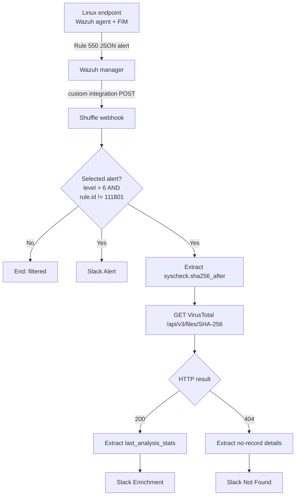

# Final SOAR Architecture

## System flow

## Trust boundaries

| Boundary | Data crossing it | Protection requirement |
| --- | --- | --- |
| Wazuh → Shuffle | Alert JSON and webhook identifier | Restrict access, rotate identifier if exposed, limit network reachability |
| Shuffle → VirusTotal | SHA-256 and API key header | Store key as a secret; never log or publish it |
| Shuffle → Slack | Alert content and webhook credential | Store URL as a secret; avoid sensitive endpoint data in messages |
| Public repository | Documentation and screenshots | Sanitize every image and example before publication |

## Data contract

The playbook depends on these Wazuh alert fields:

| Field | Use |
| --- | --- |
| `rule.id` | Filter and Slack context |
| `rule.level` | Severity threshold |
| `rule.description` | Human-readable alert title |
| `agent.name` | Affected endpoint |
| `agent.ip` | Endpoint address |
| `syscheck.path` | Modified file |
| `syscheck.sha256_after` | VirusTotal lookup key |
| `timestamp` | Event time |

Alerts that lack `syscheck.sha256_after` cannot use this file-hash enrichment path without an alternate branch.

## Availability observations

The lab architecture is functional but has several single points of failure: one Shuffle host, one webhook ingress, one worker path, and external dependencies on Slack and VirusTotal. The evidence also shows transient container, worker, DNS, and outbound-connectivity problems. Production hardening would add health monitoring, retries, failure routing, managed secrets, and defined recovery procedures.

## Final implementation evidence

- [Final playbook canvas](../evidence/06-virustotal-404/2026-09-22-040614.png)
- [Real Wazuh Rule 550 event](../evidence/02-webhook-wazuh-integration/2026-09-19-211908.png)
- [Expected VirusTotal 404 route](../evidence/06-virustotal-404/2026-09-22-054509.png)
- [VirusTotal 200 route](../evidence/07-virustotal-200/2026-09-22-054921.png)
- [Known-hash Slack result](../evidence/07-virustotal-200/2026-09-22-054811.png)

